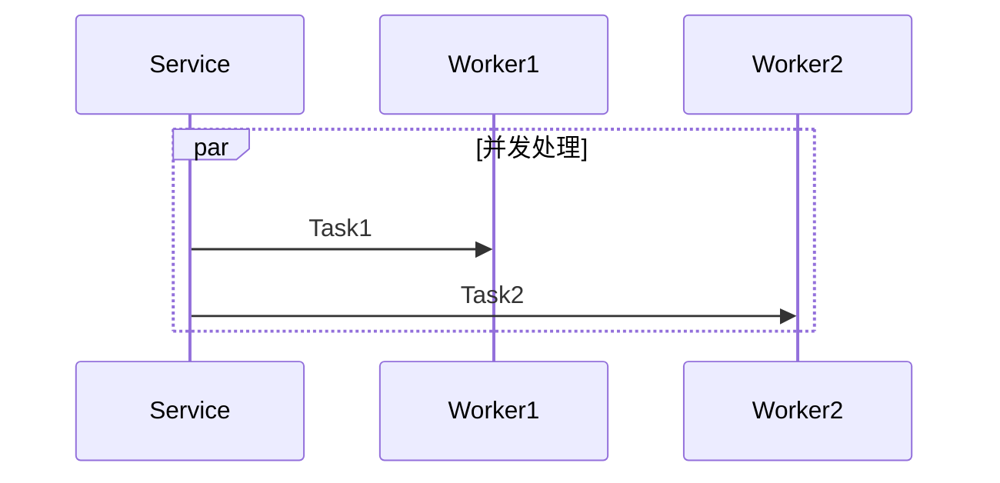
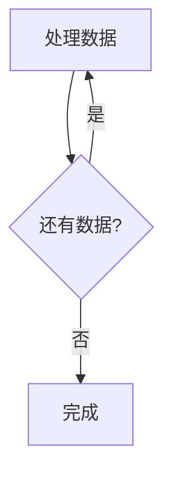

# Coder Analyzer

深度分析源码逻辑并生成结构化文档的技能。

## 核心能力

1. **递归代码扫描** - 从指定入口函数开始，自动追踪所有内部调用
2. **调用链路可视化** - 生成 Mermaid 时序图/流程图展示完整调用路径
3. **关键逻辑提取** - 自动识别校验逻辑、状态流转、异常处理等关键点
4. **结构化输出** - 生成符合 Obsidian 格式的 Markdown 文档和Obsidian格式的流程图; 使用skill: json-canvas, obsidian-bases, obsidian-markdown
5. **http rest文件生成 ** - 使用相关技能，在目录.rest/oddapi下创建xx.http, 可参考: /Users/horizon/WorkSpace/aidi-label/.rest/oddapi/3.任务审核.http


## 工作流程

### Step 1: 接收分析任务

用户提供：
- **入口信息**：文件路径 + 行号/函数名
- **关注点**（可选）：校验逻辑、状态流转、核心业务、变量定义、异常处理等
- **输出路径**（可选）：文档保存位置,如果未提供，则默认保存在:/Users/horizon/Documents/notes/4.AIOutput目录下

示例：
```
分析 service/odd/odd.go 第 271 行的 CreateOddTask 函数
关注点：创建前的校验逻辑、状态流转、异常处理
输出到：/Users/horizon/Documents/notes/createTask.md
```

**注意:** 如果用户没有输入具体要分析的函数或者请求接口路径，一定要询问用户，让用户输入；否则不要往下进行

### Step 2: 静态代码扫描

**目标**：构建完整的调用链路

**执行步骤**：

1. **读取入口函数**
   ```bash
   # 使用 Read 工具读取文件
   Read file_path: service/odd/odd.go
   # 定位到指定行号，提取函数定义
   ```

2. **识别函数调用**
   - 提取函数内部的所有方法调用
   - 使用 Grep 工具查找被调用函数的定义位置
   - 区分内部函数 vs 第三方库调用

3. **递归扫描**
   - 对每个内部函数调用，重复步骤 1-2
   - 限制递归深度为 5 层，避免过度展开
   - 记录每层调用的文件路径和行号

4. **构建调用树**
   ```
   CreateOddTask (service/odd/odd.go:271)
   ├── validateRequest (logic/odd/odd.go:150)
   │   └── checkPermissions (logic/auth/auth.go:42)
   ├── createTask (dao/task/task.go:89)
   │   ├── Begin (gorm.DB)
   │   └── Create (gorm.DB)
   └── notifyUser (logic/notify/notify.go:200)
   ```

### Step 3: 提取关键逻辑

根据用户指定的关注点，提取相关代码片段。

**自动识别模式**：

参考 `references/analysis-patterns.md` 中的模式识别规则：

- **校验逻辑**：搜索 `if err := validate`、`binding:"required"` 等
- **状态流转**：搜索 `Status =`、状态常量定义
- **事务处理**：搜索 `Begin()`、`Commit()`、`Rollback()`
- **错误处理**：搜索 `return fmt.Errorf`、`errors.Is` 等

**代码片段格式**：
```go
// service/odd/odd.go:280
if err := s.validateRequest(ctx, req); err != nil {
    return nil, fmt.Errorf("validation failed: %w", err)
}
```

### Step 4: 生成 Mermaid 图表

**图表类型选择**（详见 `references/output-template.md`）：

1. **时序图** - 多服务/模块调用，有时间顺序
2. **流程图** - 条件分支、并行处理、循环结构
3. **状态图** - 状态流转分析

**生成原则**：
- 控制图表复杂度，节点数 ≤ 15
- 突出关键路径，次要逻辑可省略
- 添加注释说明复杂分支

### Step 5: 编写文档

**输出格式**（参考 `references/output-template.md`）：

```markdown
### API 分析: CreateOddTask
- **文件路径**: `service/odd/odd.go:271`
- **功能描述**: 创建 ODD 标注任务

### 业务流程图
\`\`\`mermaid
sequenceDiagram
    Client->>Service: CreateOddTask
    Service->>Logic: validateRequest
    Service->>DAO: createTask
    DAO->>DB: INSERT
\`\`\`

### 核心逻辑说明
- **Step 1: 参数校验**
  验证请求参数完整性和权限
  ```go
  // service/odd/odd.go:280
  if err := s.validateRequest(ctx, req); err != nil {
      return nil, err
  }
  ```

- **Step 2: 创建任务**
  初始化任务记录并写入数据库

### 💡 实现亮点与潜在风险
- **亮点**: 使用事务保证数据一致性
- **风险**: 并发场景下可能存在竞态条件

### Step 6: 画流程图

使用 `json-canvas` 将流程图转换为 Obsidian 格式，并保存到指定路径。

### Step 7: Http Rest 文件生成

**重要**: HTTP 文件必须包含两部分内容：
1. **业务 API 接口** - 当前系统对外提供的接口
2. **外部系统接口** - 当前系统调用的外部服务接口（如 SaturnV、PNC 等）;当提取外部服务接口时，对应的变量需要进行设置，比如当使用{{otherservr}}时，先@otherservr=xx,进行设置
3. **禁止重复** - 每个接口只生成一个对应的请求即可，不用按照各种入参生成多个
4. **文件名称** - 生成的文件名比如 n.xxx.http,其中n是数字，不要和现有的冲突，应该是递增


#### 7.1 文件命名规范
- 文件位置: `.rest/oddapi/`
- 文件命名: `序号.功能名称.http`，例如 `4.任务前摇.http`
- 变量定义: 在 `.http-client.env.json` 文件中定义公共变量

#### 7.2 提取外部系统接口

在代码扫描阶段，需要识别以下模式的外部系统调用：

```go
// 模式 1: HTTP 客户端调用
client.Get(ctx, "/api/v1/item/search", params, result)
client.Post(ctx, "/api/v1/scenario/create", body, result)

// 模式 2: gRPC 调用
grpcClient.GetEventDetail(ctx, &pb.GetEventDetailReq{...})

// 模式 3: 第三方 SDK 调用
pncClient.ListScenario(ctx, api.ListScenarioReq{...})
saturnvClient.GetEventDetail(ctx, ...)
```

**提取信息包括**：
- API 路径（URL）
- HTTP 方法（GET/POST/PUT/DELETE）
- 请求参数（Query、Body）
- 请求头（Headers）
- 响应结构（关键字段）

#### 7.3 HTTP 文件格式模板

```http
### 功能名称 API
# 公共变量定义在 .http-client.env.json 文件中

@taskId=1
@eventId=event_123
@scenarioId=scenario_456

###
### ========================================
### 一、业务 API 接口
### ========================================


### 1. 接口名称描述
POST {{baseUrl}}/api/v1/odd/task/event_windup
Content-Type: application/json
X-Forwarded-User: {{token}}

{
  "task_id": {{taskId}},
  "time_offset": 30
}

### 2. 接口名称描述（带错误场景）
POST {{baseUrl}}/api/v1/odd/task/event_windup
Content-Type: application/json
X-Forwarded-User: {{token}}

{
  "task_id": 999999,
  "time_offset": 100
}


### ========================================
### 二、外部系统接口（供参考）
### ========================================

### 10. SaturnV - 查询事件详情
# 用途: 获取事件的详细信息
GET {{saturnvUrl}}/saturnv/api/v1/item/search?item_type_name=Event&structs=Event_Issue&per_page=1&query_str=Event.id%20%3D%20%22{{eventId}}%22
X-Forwarded-User: {{token}}

### 11. PNC - 查询场景列表
# 用途: 根据条件查询场景
GET {{pncUrl}}/api/v1/pncops/scenario/list?current=1&per_page=1&is_invalid=false&query_str=...
X-Forwarded-User: {{pncToken}}

### 12. PNC - 复制场景
# 用途: 复制场景并修改参数
POST {{pncUrl}}/api/v1/pncops/scenario/copy_scenario
Content-Type: application/json
Authorization: Bearer {{pncToken}}

{
  "column_pairs": {
    "basic": {
      "badcase_id": "{{eventId}}",
      "bag_info": {
        "bag_clip": {
          "st": 1738339170000
        }
      },
      "followers": ["@label_odd"]
    }
  },
  "source_id": "{{sourceScenarioId}}"
}


### ========================================
### 说明文档
### ========================================
#
# 【业务流程】
# 1. 客户端调用接口 1
# 2. 系统执行业务逻辑
# 3. 调用外部系统接口 10、11、12
# 4. 返回结果
#
# 【参数说明】
# - task_id: 任务ID
# - time_offset: 时间偏移量
#
# 【外部系统依赖】
# 1. SaturnV API - 查询事件详情
# 2. PNC API - 场景管理
#
# 【错误码】
# - ErrorCode1: 错误描述
```

#### 7.4 代码扫描关键点

**需要扫描的文件模式**：
```bash
# 查找 HTTP 客户端定义
grep -rn "Client\|client" --include="*.go" | grep -E "Get|Post|Put|Delete"

# 查找 API 路径常量
grep -rn "const.*Action\|const.*Uri\|const.*Url" --include="*.go"

# 查找外部服务调用
grep -rn "NewClient\|NewPncClient\|NewSaturnvClient" --include="*.go"
```

**关键文件位置**：
- `pkg/api/` - 外部 API 客户端定义
- `logic/odd/` - 业务逻辑中的外部调用
- `conf_odd/` - 外部服务配置（URL、Token 等）


### Step 8: 保存文档

如果用户指定了输出路径，则保存到指定路径，否保存在: /Users/horizon/Documents/notes/4.AIOutput目录下
```bash
# 使用 Write 工具保存文档
Write file_path: /Users/horizon/Documents/notes/4.AIOutput/xxx_代码逻辑.md
# 使用
Write file_path: /Users/horizon/Documents/notes/4.AIOutput/xxx_流程图.canvas
```

## 分析深度控制

为避免输出过长，采用分层策略：

**Level 1（默认）**：
- 主流程 + 2 层子调用
- 关键代码片段
- 简要说明

**Level 2（用户要求详细时）**：
- 主流程 + 4 层子调用
- 完整代码片段
- 详细注释

**Level 3（极端复杂场景）**：
- 建议分多次分析
- 每次聚焦一个子模块

## 特殊场景处理

### 并发逻辑
使用 Mermaid `par` 语法：


### 循环结构
在流程图中使用条件回边：


### 大型代码库
先使用 Grep 定位关键函数：
```bash
# 搜索函数定义
grep -rn "func CreateOddTask" --include="*.go"
```

## 使用建议

1. **首次分析** - 先使用 Level 1 快速理解整体流程
2. **深入分析** - 针对关键模块使用 Level 2/3
3. **持续迭代** - 随着代码演进，更新文档
4. **结合测试** - 参考单元测试理解边界情况

## 参考资源

- `references/output-template.md` - 输出文档格式模板和 Mermaid 图表示例
- `references/analysis-patterns.md` - 代码分析模式和常见问题处理
