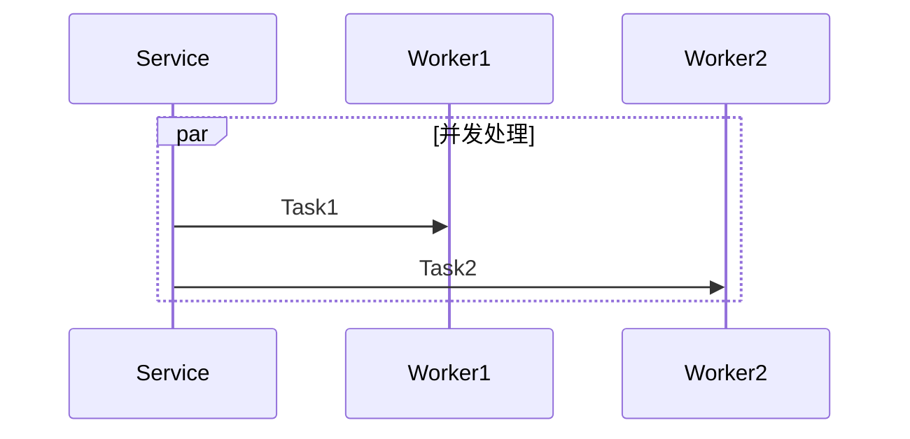
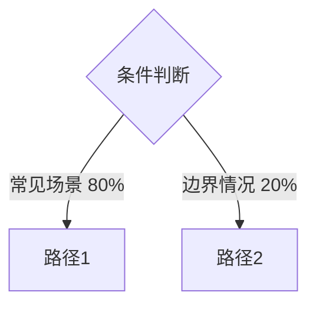

# 代码分析模式

## Go 语言分析要点

### 1. 项目结构识别

```
api/       → Proto 定义 (接口层)
service/   → HTTP/gRPC 处理器 (请求处理)
logic/     → 业务逻辑层
dao/       → 数据访问层
  model/   → GORM 模型
```

### 2. 调用链路追踪

**入口识别**：
- HTTP Handler: `func (s *Service) HandleXXX(c *gin.Context)`
- gRPC Handler: `func (s *Server) XXX(ctx context.Context, req *pb.Request)`
- 定时任务: `func (j *Job) Run()`

**递归扫描**：
1. 识别方法调用的其他函数
2. 追踪结构体方法的跨文件调用
3. 忽略第三方库（vendor/, go.mod 依赖）
4. 记录调用深度（建议最多 5 层）

### 3. 关键逻辑提取

**校验逻辑**：
```go
// 寻找这类模式
if err := validate(req); err != nil {
    return err
}

if req.Field == "" {
    return errors.New("field required")
}
```

**状态流转**：
```go
// 寻找状态常量定义
const (
    StatusPending = "pending"
    StatusProcessing = "processing"
)

// 寻找状态变更
task.Status = StatusProcessing
```

**事务处理**：
```go
// 寻找事务边界
tx := db.Begin()
defer func() {
    if r := recover(); r != nil {
        tx.Rollback()
    }
}()
```

**错误处理**：
```go
// 寻找错误包装和返回
if err != nil {
    return fmt.Errorf("operation failed: %w", err)
}
```

### 4. 变量与概念定义

**常量定义**：
- 搜索 `const` 块
- 记录枚举类型
- 状态码映射

**配置项**：
- 搜索结构体字段 tag: `json:"field"`
- 识别必需字段: `binding:"required"`

**领域模型**：
- 查看 `dao/model/` 目录
- 记录实体关系（外键、关联）

### 5. 异常处理机制

**错误类型**：
```go
// 自定义错误
type BusinessError struct {
    Code    int
    Message string
}

// 错误判断
if errors.Is(err, ErrNotFound) {
    // 处理逻辑
}
```

**Panic 恢复**：
```go
defer func() {
    if r := recover(); r != nil {
        // 恢复逻辑
    }
}()
```

## 分析工作流

### Phase 1: 静态扫描
1. 读取入口文件和行号
2. 识别函数签名和参数
3. 使用 Grep 查找函数定义位置

### Phase 2: 调用链构建
1. 递归追踪函数调用
2. 记录每层调用的文件路径和行号
3. 区分内部调用 vs 外部依赖

### Phase 3: 逻辑提取
1. 提取关键代码片段（带行号）
2. 识别控制流（if/switch/loop）
3. 标注数据流（参数传递、返回值）

### Phase 4: 文档生成
1. 按 Obsidian 模板格式组织
2. 生成 Mermaid 图表
3. 添加代码引用链接

## 常见问题处理

### Q: 函数调用过深怎么办？
A: 限制递归深度为 5 层，超过的部分用 "..." 省略，并注明可继续深入分析。

### Q: 如何处理并发逻辑？
A: 使用 Mermaid 的 `par` 语法展示并发：


### Q: 如何处理复杂的条件分支？
A: 使用 flowchart 并标注条件概率或重要性：

