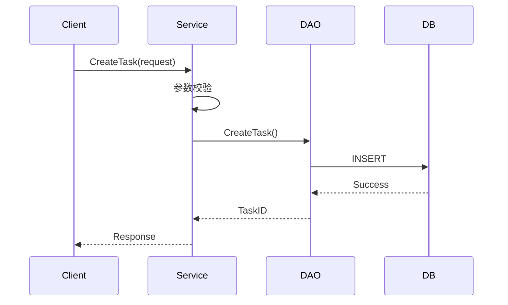
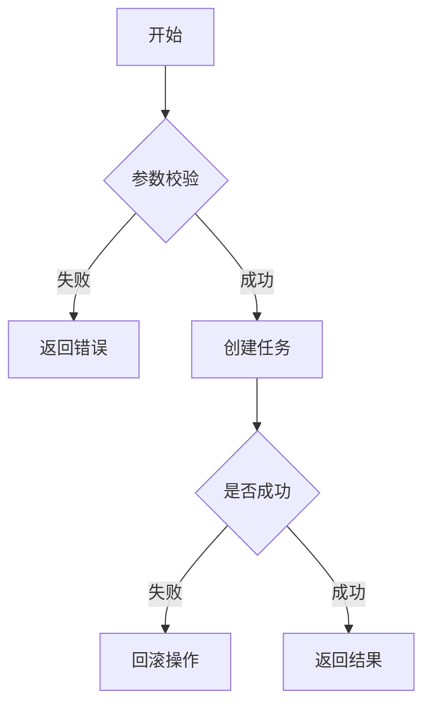
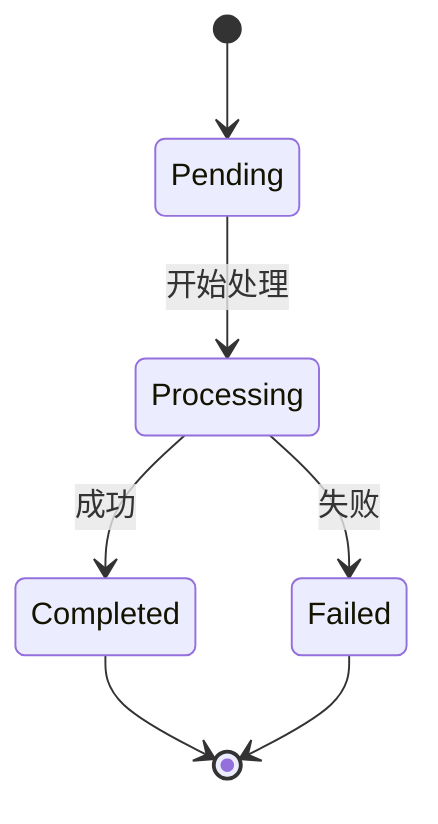

# 输出文档模板

## 标准 Obsidian 输出格式

```markdown
### API 分析: [API Name]
- **文件路径**: `[Source Path]`
- **功能描述**: [简短描述]

### 业务流程图
\`\`\`mermaid
[Mermaid 流程图代码]
\`\`\`

### 核心逻辑说明
- **Step 1**: [说明及关键代码片段]
  ```go
  // 代码示例
  ```
- **Step 2**: [说明及关键代码片段]

### 💡 实现亮点与潜在风险
- **亮点**: [描述]
- **风险**: [描述]
```

## Mermaid 图表类型选择

### 1. 时序图 (sequenceDiagram)
适用场景：
- 多个服务/模块之间的调用关系
- 有明确的时间顺序
- 需要展示请求-响应流程

示例：


### 2. 流程图 (flowchart)
适用场景：
- 条件分支逻辑
- 并行处理
- 循环结构
- 单个服务内部逻辑

示例：


### 3. 状态图 (stateDiagram)
适用场景：
- 状态流转分析
- 生命周期展示

示例：


## 代码片段引用格式

```go
// 文件路径: service/odd/odd.go:271
func (s *OddService) CreateOddTask(ctx context.Context, req *CreateOddTaskRequest) error {
    // 核心逻辑
}
```

使用 `file_path:line_number` 格式便于定位。
