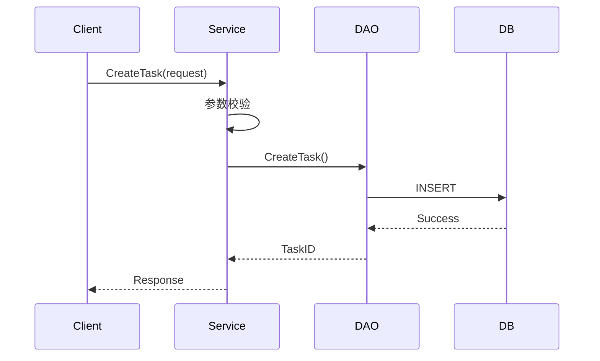
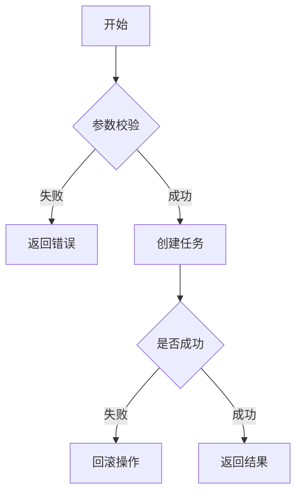
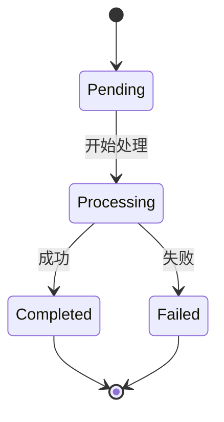

# 输出文档模板

## 标准 Obsidian 输出格式

```markdown
### API 分析: [API Name]
- **文件路径**: `[Source Path]`
- **功能描述**: [简短描述]

### 业务流程图
​```mermaid
[Mermaid 流程图代码]
​```

### 核心逻辑说明
- **Step 1**: [说明及关键代码片段]
  ```go
  // 代码示例
  ```
- **Step 2**: [说明及关键代码片段]

### 实现亮点与潜在风险
- **亮点**: [描述]
- **风险**: [描述]
```

## 调用树格式

```
CreateOddTask (service/odd/odd.go:271)
├── validateRequest (logic/odd/odd.go:150)
│   └── checkPermissions (logic/auth/auth.go:42)
├── createTask (dao/task/task.go:89)
│   ├── Begin (gorm.DB)
│   └── Create (gorm.DB)
└── notifyUser (logic/notify/notify.go:200)
```

## Mermaid 图表类型选择

### 1. 时序图 (sequenceDiagram)
适用场景：多服务/模块调用、有时间顺序、请求-响应流程



### 2. 流程图 (flowchart)
适用场景：条件分支逻辑、并行处理、循环结构、单个服务内部逻辑



### 3. 状态图 (stateDiagram)
适用场景：状态流转分析、生命周期展示



## HTTP REST 文件模板

### 文件命名规范
- 文件位置: `.rest/oddapi/`
- 文件命名: `序号.功能名称.http`，序号递增不冲突
- 变量定义: 在 `.http-client.env.json` 文件中定义公共变量

### HTTP 文件格式

```http
### 功能名称 API
# 公共变量定义在 .http-client.env.json 文件中

@taskId=1
@eventId=event_123
@scenarioId=scenario_456

###
### ========================================
### 一、业务 API 接口
### ========================================

### 1. 接口名称描述
POST {{baseUrl}}/api/v1/odd/task/event_windup
Content-Type: application/json
X-Forwarded-User: {{token}}

{
  "task_id": {{taskId}},
  "time_offset": 30
}

### ========================================
### 二、外部系统接口（供参考）
### ========================================

### 10. SaturnV - 查询事件详情
# 用途: 获取事件的详细信息
GET {{saturnvUrl}}/saturnv/api/v1/item/search?item_type_name=Event&structs=Event_Issue&per_page=1&query_str=Event.id%20%3D%20%22{{eventId}}%22
X-Forwarded-User: {{token}}

### 11. PNC - 查询场景列表
GET {{pncUrl}}/api/v1/pncops/scenario/list?current=1&per_page=1&is_invalid=false&query_str=...
X-Forwarded-User: {{pncToken}}

### ========================================
### 说明文档
### ========================================
#
# 【业务流程】
# 1. 客户端调用接口 1
# 2. 调用外部系统接口 10、11
# 3. 返回结果
#
# 【外部系统依赖】
# 1. SaturnV API - 查询事件详情
# 2. PNC API - 场景管理
```

### 外部系统接口提取模式

```go
// 模式 1: HTTP 客户端调用
client.Get(ctx, "/api/v1/item/search", params, result)
client.Post(ctx, "/api/v1/scenario/create", body, result)

// 模式 2: gRPC 调用
grpcClient.GetEventDetail(ctx, &pb.GetEventDetailReq{...})

// 模式 3: 第三方 SDK 调用
pncClient.ListScenario(ctx, api.ListScenarioReq{...})
saturnvClient.GetEventDetail(ctx, ...)
```

## 代码片段引用格式

```go
// 文件路径: service/odd/odd.go:271
func (s *OddService) CreateOddTask(ctx context.Context, req *CreateOddTaskRequest) error {
    // 核心逻辑
}
```

使用 `file_path:line_number` 格式便于定位。
