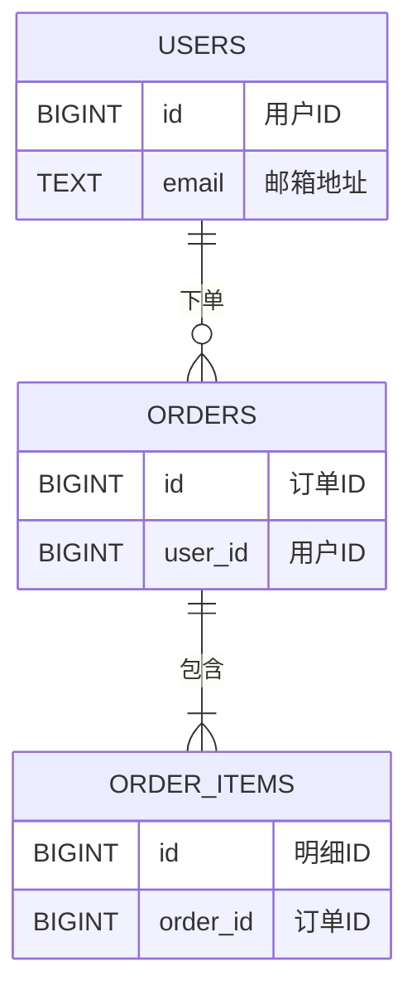

# Coder Create SQL

结构化流程生成建表SQL，所有字段和表必须带中文注释，只输出SQL不输出代码。

## Workflow

```
用户需求 → Step 1: 头脑风暴 → Step 2: 确认数据库类型 → Step 3: 调用对应skill设计 → Step 4: 绘制ER关系图 → Step 5: 输出SQL文件
```

## Step 1: 头脑风暴

Invoke `brainstorming` skill，与用户沟通：

- **业务实体**: 需要哪些表？各表的业务含义？
- **字段需求**: 每张表包含哪些字段？字段类型和大致长度？
- **关联关系**: 表之间外键关系（一对一、一对多、多对多）
- **约束条件**: 哪些字段必填、唯一、有默认值？
- **索引需求**: 常用查询场景，哪些字段需要索引？
- **业务规则**: 状态枚举值、数据校验规则等

## Step 2: 确认数据库类型

向用户确认目标数据库类型：

| 数据库 | Invoke Skill |
|--------|-------------|
| PostgreSQL | `postgresql-table-design` |
| MySQL | `database-schema-designer` |

若用户未指定，主动询问。

## Step 3: 调用对应 Skill 设计表结构

根据 Step 2 结果 invoke 对应 skill。

### 铁律（不可违反）

1. **所有字段必须添加中文注释** — 无一例外
2. **每张表必须有表名注释** — 无一例外
3. **只输出 SQL DDL** — 不生成 Go/Java/Python 代码实现

### PostgreSQL 注释模板

```sql
CREATE TABLE users (
  id BIGINT GENERATED ALWAYS AS IDENTITY PRIMARY KEY,
  email TEXT NOT NULL
);
COMMENT ON TABLE users IS '用户表';
COMMENT ON COLUMN users.id IS '用户ID';
COMMENT ON COLUMN users.email IS '邮箱地址';
```

### MySQL 注释模板

```sql
CREATE TABLE users (
  id BIGINT AUTO_INCREMENT PRIMARY KEY COMMENT '用户ID',
  email VARCHAR(255) NOT NULL COMMENT '邮箱地址'
) COMMENT '用户表';
```

## Step 4: 绘制 ER 关系图

基于 Step 3 设计的表结构，用 Markdown 输出 ER 关系图。

### 格式要求

使用 Mermaid ER Diagram 语法：



### 关系符号

| 符号 | 含义 |
|------|------|
| `\|\|--\|{` | 一对多（必选） |
| `\|\|--o{` | 一对多（可选） |
| `\|\|--\|\|` | 一对一 |
| `}\|--\|{` | 多对多 |

### 规则

- 每个实体列出**主键 + 外键 + 核心业务字段**（无需列出全部字段，避免图表臃肿）
- 关系线上标注中文业务含义
- ER 图与 SQL 文件保存在同一目录，文件名: `{业务名称}_er.md`

## Step 5: 输出 SQL 文件

1. 询问用户 SQL 文件保存路径
2. 若未提供路径，保存到当前工作目录，文件名: `{业务名称}_schema.sql`
3. SQL 文件头部包含简要说明

### 文件头部模板

```sql
-- ============================================
-- 数据库类型: {PostgreSQL/MySQL}
-- 业务名称: {名称}
-- 表清单: {表1, 表2, ...}
-- ============================================
```

## Red Flags — 停下检查

- 字段没有中文注释 → 补全 COMMENT
- 表没有注释 → 补全 COMMENT ON TABLE / 表级 COMMENT
- 输出了代码实现（Go struct、Java class） → 删除，只保留 SQL
- 未确认数据库类型就写 SQL → 先确认类型再继续
- ER 图列出全部字段导致图表臃肿 → 只列主键+外键+核心字段
- ER 图关系线缺少中文业务含义 → 每条关系线必须标注

## Common Mistakes

| 错误 | 修正 |
|------|------|
| 忘记给 id、created_at 等通用字段加注释 | 每个字段都必须有 COMMENT，包括自增ID和时间戳 |
| PostgreSQL 用行内 COMMENT 语法 | PG 用独立的 `COMMENT ON COLUMN` 语句 |
| MySQL 用 `COMMENT ON COLUMN` 语法 | MySQL 用行内 `COMMENT 'xxx'` |
| 生成了 ORM 模型代码 | 只输出 SQL DDL，不输出代码 |
| 未指定文件保存路径就直接输出 | 先询问路径，未提供则用默认路径 |
| ER 图列出所有字段导致不可读 | 只列主键+外键+核心业务字段 |
| ER 图关系线无业务含义标注 | 每条关系线必须用中文标注业务含义 |
