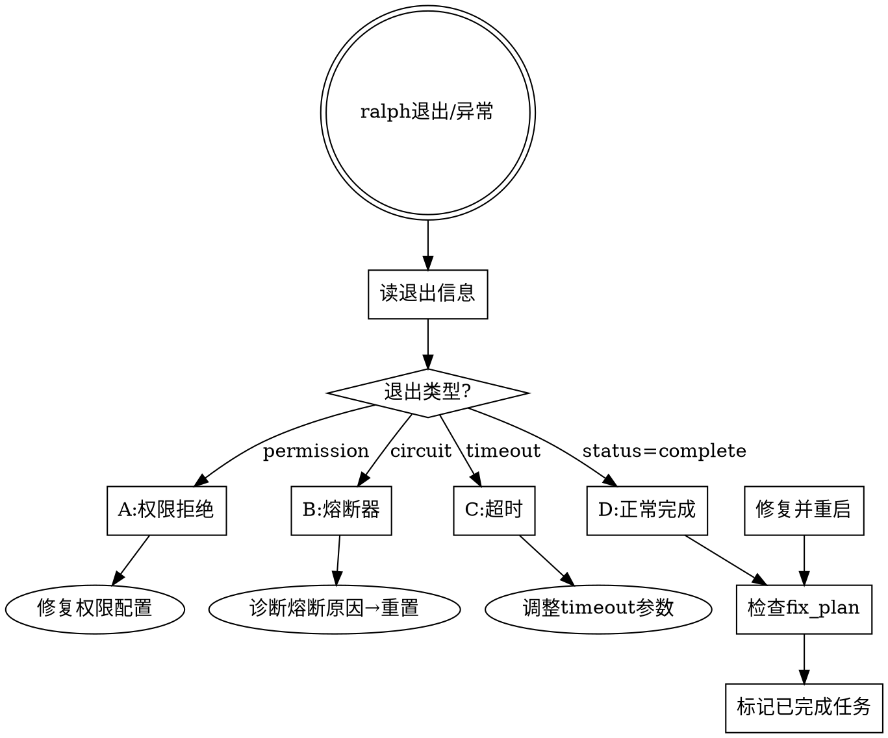
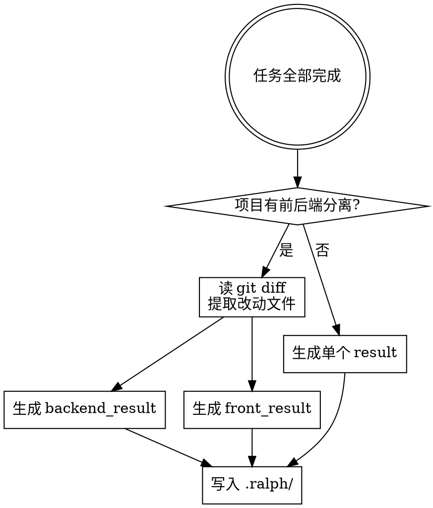

# Coder Exec Ralph — 稳健执行与任务状态同步

Ralph `--monitor` 模式的两个致命问题：**意外退出**和**任务完成不标记**。本 skill 提供诊断、修复和预防方案。

## 核心原则

1. **ralph 全自动执行** — 诊断、修复、重启、标记、提交全部自动完成，不依赖人工
2. **退出不等于失败** — 自动诊断退出原因并自动修复重启
3. **任务状态必须闭环** — fix_plan.md 的 `[ ]` → `[x]` 自动标记，不留未完成状态

## 问题诊断流程



## 问题 1：Ralph 意外退出 — 诊断与修复

### 诊断步骤

ralph 退出后，依次检查以下文件（从信息量最大到最小）：

| 检查顺序 | 文件 | 获取什么信息 |
|---------|------|------------|
| 1 | `.ralph/status.json` | `exit_reason`、`status`、`loop_count` |
| 2 | `.ralph/.circuit_breaker_state` | 熔断器状态、触发原因、连续计数 |
| 3 | `.ralph/.exit_signals` | `done_signals`、`completion_indicators` |
| 4 | `.ralph/progress.json` | 最近一次循环的结果（timed_out/complete/error） |
| 5 | `.ralph/live.log` 尾部 | 最后的工具调用和错误信息 |

### 退出类型与修复方案

| 退出类型 | 识别特征 | 修复方案 |
|---------|---------|---------|
| 权限拒绝 | `consecutive_permission_denials > 0` 或 live.log 中大量 Permission denied | 1. 读 `.ralphrc` 的 `ALLOWED_TOOLS` 2. 将被拒绝的工具加入允许列表 3. 重启 |
| 熔断器触发 | `state: OPEN`，`consecutive_no_progress` 或 `consecutive_same_error` 超阈值 | 1. 读原因字段 2. 根据原因修复（见下方熔断器专题）3. `ralph --reset-circuit` 重置 4. 重启 |
| 超时退出 | `status: timed_out_productive` 或 `CLAUDE_TIMEOUT_MINUTES` 不足 | 1. 增加 `.ralphrc` 的 timeout 2. 或用 `-t` 参数指定更长超时 3. 重启 |
| 会话过期 | `SESSION_EXPIRY_HOURS` 超限 | 1. `ralph --reset-session` 重置 2. 或增加 expiry hours 3. 重启 |

### 权限拒绝 — 最常见的退出原因

**原因**：`.ralphrc` 的 `ALLOWED_TOOLS` 列表不够覆盖 Ralph 循环中实际需要的操作。

**修复步骤**：

1. 读 `.ralph/live.log`，grep `Permission` 或 `denied`，提取被拒绝的工具名
2. 将缺失工具加入 `.ralphrc` 的 `ALLOWED_TOOLS`（用逗号分隔）
3. 常见遗漏工具清单：

| 容易遗漏的工具 | 适用场景 |
|-------------|---------|
| `Bash(pip install *)` | Python 依赖安装 |
| `Bash(npm install *)` | 前端依赖安装 |
| `Bash(python -m pytest *)` | pytest 子进程 |
| `Bash(alembic upgrade *)` | 数据库迁移 |
| `Bash(docker *)` | 容器操作 |
| `Bash(source *)` | 环境激活 |
| `Agent` | 子代理调度 |
| `TaskCreate/TaskUpdate/TaskList/TaskGet` | 任务管理 |

4. 保存 `.ralphrc` 后重启 ralph

### 熔断器触发 — 诊断与重置

**熔断器三种触发条件**（对应 `.ralphrc` 的三个阈值）：

| 触发条件 | 配置项 | 默认阈值 | 含义 |
|---------|-------|---------|------|
| 无进展 | `CB_NO_PROGRESS_THRESHOLD` | 3 | 连续 N 次循环文件无变化 |
| 相同错误循环 | `CB_SAME_ERROR_THRESHOLD` | 5 | 连续 N 次出现相同错误 |
| 输出质量下降 | `CB_OUTPUT_DECLINE_THRESHOLD` | 60 | 输出长度下降超 N% |

**诊断**：读 `.ralph/.circuit_breaker_state` 的 `reason` 字段。

**修复**：

| reason | 修复 |
|--------|------|
| consecutive_no_progress | 检查 fix_plan.md 任务是否合理（是否太模糊/太依赖外部条件）；精简或调整任务描述 |
| consecutive_same_error | 读 live.log 找到重复错误，通常是：依赖缺失、环境不对、权限不足；修复根因后重置 |
| output_decline | 任务可能已近完成但 Ralph 不知道怎么收尾；自动标记完成或增加退出信号 |

**重置命令**：
```bash
ralph --reset-circuit          # 仅重置熔断器
ralph --reset-circuit --auto-reset-circuit  # 启动时自动重置
ralph --reset-session          # 重置会话（清除上下文延续）
```

## 问题 2：fix_plan.md 任务状态不标记完成

**根本原因**：Ralph 循环中完成任务后，只在 RALPH_STATUS 中报告 `TASKS_COMPLETED_THIS_LOOP: N`，但不会自动将 fix_plan.md 的 `- [ ]` 改为 `- [x]`。

### 自动标记流程

ralph 每轮循环结束后，自动检查并标记：

1. 读 `.ralph/live.log` 尾部，找 RALPH_STATUS 区块
2. 提取 `TASKS_COMPLETED_THIS_LOOP` 数值和 `STATUS` 字段
3. 对照 `.ralph/fix_plan.md`，将已完成的 `- [ ]` 改为 `- [x]`
4. 优先从 High → Medium → Low 顺序标记（Ralph 按优先级执行）

### 快速标记脚本

对项目目录执行以下命令，快速诊断哪些任务已完成但未标记：

```bash
# 查看 ralph 本轮声称完成了多少任务
grep "TASKS_COMPLETED_THIS_LOOP" .ralph/live.log | tail -1

# 查看 fix_plan.md 中已标记 vs 未标记的比例
echo "已完成: $(grep -c '\- \[x\]' .ralph/fix_plan.md)"
echo "未完成: $(grep -c '\- \[ \]' .ralph/fix_plan.md)"

# 查看最近 git diff 涉及的文件，推断完成了哪些任务
git diff --name-only HEAD~5
```

### 批量标记策略

当 ralph 运行了多轮但 fix_plan.md 从未更新时，自动执行：

1. 读 `.ralph/archive/` 目录 — 已归档的任务说明哪些已完成
2. 读 `git log` 最近提交 — 每个提交对应哪些任务
3. 交叉对比 fix_plan.md 任务描述和实际代码变更
4. 将匹配到的任务自动标记为 `[x]`

## 启动前的预防检查清单

每次启动 `ralph --monitor` 前执行：

| 检查项 | 命令 | 期望结果 |
|-------|------|---------|
| 熔断器状态 | `ralph --circuit-status` | `CLOSED` |
| 会话状态 | `ralph --status` | `status: running` 或可重置 |
| fix_plan 任务 | `grep -c '\- \[ \]' .ralph/fix_plan.md` | > 0（有未完成任务） |
| 权限覆盖 | 对比 ALLOWED_TOOLS 与项目需求 | 覆盖所有必要操作 |
| git 状态 | `git status` | 无未提交冲突 |

### 推荐启动参数

```bash
# 标准启动（带通知和自动熔断重置）
ralph --monitor --notify --auto-reset-circuit

# 新任务启动（不复用旧会话上下文）
ralph --monitor --notify --no-continue --auto-reset-circuit

# 复杂任务（更长超时）
ralph --monitor --notify -t 30 --auto-reset-circuit

# 查看实时工具参数
ralph --monitor --notify --show-tool-args --auto-reset-circuit
```

## 运行中的自动干预

ralph 在 tmux 中运行时，监控进程自动干预：

| 场景 | 自动操作 |
|------|---------|
| ralph 卡在同一个错误 | 1. `ralph --reset-circuit` 重置熔断器 2. 自动修改 fix_plan.md 调整任务描述 3. 如必要，自动修改源代码解决阻塞问题 |
| ralph 在做无关任务 | 自动编辑 fix_plan.md，移除或降级无关任务 |
| 权限不足 | 自动编辑 `.ralphrc` 的 `ALLOWED_TOOLS`，补入被拒绝的工具，自动重启 ralph |
| 需要暂停 | tmux detach（不杀死进程） |
| 需要完全停止 | tmux kill-session，或 Ctrl+C |

## 完成后收尾

ralph 正常完成（所有任务 `[x]`）后的收尾步骤：

1. **标记 fix_plan.md** — 自动将已完成任务的 `[ ]` 改为 `[x]`
2. **生成执行结果文件** — 自动输出改动清单和代码摘要（见下方模板）
3. **验证代码** — 运行完整测试套件，确认所有通过
4. **代码审查** — 自动检查 ralph 生成的代码质量（见 `coder-go-review` 或 `coder-analyzer`）
5. **归档** — 自动将 fix_plan.md 已完成任务归档到 `.ralph/archive/`
6. **git 提交** — 自动提交所有改动代码，提交信息遵循 Conventional Commits 格式

### 执行结果文件 — 必须生成

任务完成后，**必须**输出执行结果文件到 `.ralph/` 目录。

**文件命名规则**：
- 纯后端项目 → `.ralph/ralph_backend_result.md`
- 纯前端项目 → `.ralph/ralph_front_result.md`
- 前后端项目 → 同时输出两个文件

| 文件 | 覆盖范围 |
|------|---------|
| `ralph_backend_result.md` | 后端所有改动：ORM/Schema/API/爬虫/迁移/测试 |
| `ralph_front_result.md` | 前端所有改动：类型/页面/组件/mock/样式/测试 |

**判断前后端的方法**：读 `.ralphrc` 的 `PROJECT_TYPE` 和 `.ralph/AGENT.md` 的技术栈描述，结合项目目录结构（`src/backend/` / `src/frontend/` 或类似分目录）。

### 结果文件模板

#### ralph_backend_result.md

```markdown
# Ralph 执行结果 — 后端

## 概要
- 任务周期：[起止时间]
- 完成任务数：[N] / 总任务数：[M]
- 关键产出：[1-2 句核心成果描述]

## 改动文件清单

### 新增文件
| 文件路径 | 说明 | 关键代码摘要 |
|---------|------|------------|
| `src/backend/app/crawler/xxx.py` | 新爬虫类 | 类名 XXX，继承 YYY，核心方法 `fetch_batch()` |
| `src/backend/alembic/versions/0xx_xxx.py` | 数据库迁移 | 新增 N 个字段到 table_xxx |
| `src/backend/tests/test_xxx.py` | 测试 | N 个测试函数，覆盖场景列表 |

### 修改文件
| 文件路径 | 改动类型 | 改动内容摘要 |
|---------|---------|------------|
| `src/backend/app/models/xxx.py` | 新增字段 | Model 新增 N 个字段：field1(type), field2(type) |
| `src/backend/app/schemas/xxx.py` | 新增字段 | ResponseSchema 新增 N 个字段 |
| `src/backend/app/api/xxx.py` | 新增返回 | API endpoint 返回新增字段 |
| `src/backend/app/services/xxx.py` | 逻辑修改 | 方法 YYY 的 ZZZ 逻辑变更 |

### 删除文件（如有）
| 文件路径 | 原因 |
|---------|------|
| — | — |

## 测试结果
- 测试套件：[pytest/vitest 等]
- 运行命令：[具体命令]
- 结果：✅ PASS / ❌ FAIL
- 覆盖的测试函数列表：
  - `test_xxx_1` ✅
  - `test_xxx_2` ✅

## 关键设计决策
| 决策 | 选择 | 原因 |
|------|------|------|
| [例如：爬虫继承关系] | [继承 BaseCrawler] | [复用限速/重试/注册机制] |

## 风险与注意事项
- [例如：迁移需要先 alembic upgrade head]
- [例如：新增字段 nullable，旧数据为 NULL]
```

#### ralph_front_result.md

```markdown
# Ralph 执行结果 — 前端

## 概要
- 任务周期：[起止时间]
- 完成任务数：[N] / 总任务数：[M]
- 关键产出：[1-2 句核心成果描述]

## 改动文件清单

### 新增文件
| 文件路径 | 说明 | 关键代码摘要 |
|---------|------|------------|
| `src/frontend/src/components/XxxCard.tsx` | 新组件 | Props 定义、核心渲染逻辑 |
| `src/frontend/src/test/test_xxx.ts` | 测试 | N 个测试用例 |

### 修改文件
| 文件路径 | 改动类型 | 改动内容摘要 |
|---------|---------|------------|
| `src/frontend/src/api/xxx.ts` | 类型新增 | XxxDetail 新增 N 个字段 |
| `src/frontend/src/pages/XxxList.tsx` | UI 新增 | Descriptions 新增 N 行展示 |
| `src/frontend/src/test/handlers.ts` | Mock 新增 | MSW handler 新增 N 个字段 |

### 删除文件（如有）
| 文件路径 | 原因 |
|---------|------|
| — | — |

## 测试结果
- 测试套件：[Vitest/Jest]
- 运行命令：[具体命令]
- 结果：✅ PASS / ❌ FAIL
- 覆盖的测试用例列表：
  - `test xxx render` ✅
  - `test xxx field display` ✅

## 关键设计决策
| 决策 | 选择 | 原因 |
|------|------|------|
| [例如：字段展示方式] | [Descriptions 行] | [与现有详情页风格一致] |

## 风险与注意事项
- [例如：新字段需后端 API 先部署]
- [例如：Mock 数据需与真实 API 字段对齐]
```

### 结果文件生成流程



**生成步骤**：

1. **收集改动** — `git diff --stat HEAD~N`（N = ralph 启动后的提交数），或对比 `.ralph/.loop_start_sha`
2. **分类** — 按文件路径归属前端/后端目录分组
3. **提取代码摘要** — 对每个改动文件，读关键部分（新增类/函数签名、修改的字段列表）
4. **填充模板** — 按上方格式生成 markdown
5. **写入 `.ralph/`** — 文件名严格遵循 `ralph_backend_result.md` / `ralph_front_result.md`

**禁止**：
- 不写空模板 — 必须有实际改动内容
- 不笼统写"修改了若干文件" — 每个文件必须列出具体改动摘要
- 不遗漏测试文件 — 测试是执行结果的一部分

## Common Mistakes

| 错误 | 修正 |
|------|------|
| 重启前不检查熔断器原因 | 必须先读 `.circuit_breaker_state` 的 reason，修复根因再重置 |
| 重启前不检查权限 | 必须对比 live.log 的 Permission denied 和 .ralphrc 的 ALLOWED_TOOLS |
| 忽略 fix_plan.md 的状态 | 每轮结束后必须检查并标记已完成任务 |
| 直接 `--reset-circuit` 不修根因 | 熔断器会再次触发，浪费循环 |
| 用 `--no-continue` 但旧任务还在 | `--no-continue` 创建新会话但 fix_plan.md 不变，需同步清理 |
| 不看 live.log 尾部 | 最重要的诊断信息在 live.log 最近 50 行 |
| 任务完成后不生成结果文件 | 必须生成 ralph_backend_result.md / ralph_front_result.md |
| 结果文件写空模板 | 每个文件必须有具体改动摘要，不笼统 |
| 前后端改动混在同一个结果文件 | 有前后端的项目必须拆为两个独立文件 |

## Red Flags

- ralph 连续退出 3 次以上 → 停止重启，彻底诊断根因
- fix_plan.md 全部 `[ ]` 但 live.log 声称完成多个任务 → 自动标记所有已完成任务
- 熔断器 OPEN 且 reason 为 same_error → 必须先修复代码问题，不能只重置
- `.ralphrc` 中 `PROJECT_NAME` / `PROJECT_TYPE` 是占位符 → 必须先填充再启动
- git 有未提交冲突 → 必须先解决再启动 ralph
- 任务完成但 .ralph/ 下无 ralph_*_result.md → 自动补生成执行结果文件
- 前后端项目只输了一个结果文件 → 必须拆为 ralph_backend_result.md + ralph_front_result.md