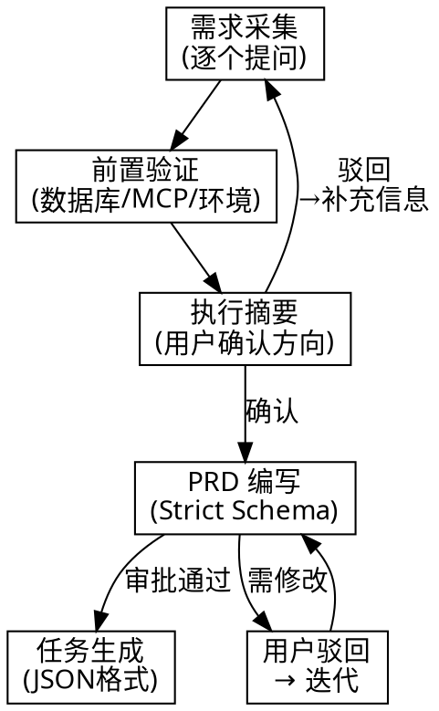

# PRD Creation & Task Generation

将想法转化为可执行的开发任务：结构化需求采集 → 质量级 PRD → JSON 实现任务列表。

**核心原则：每个需求必须可量化、可验证。每个 PRD 必须证明它能落地。**

## When to Use

- 从零开始规划新产品或功能
- 将模糊想法转为具体技术规格
- AI/智能系统功能的需求定义
- 已有 PRD 需要拆解为开发任务列表
- 用户说 "写PRD"、"规划需求"、"需求分析"、"任务拆解"

## Workflow



### Phase 1: 需求采集

逐个提问，每次一个问题，用 AskUserQuestion。覆盖 6 个维度：

| 维度 | 核心问题 |
|------|---------|
| 业务目标 | 为什么要现在做？解决什么痛点？ |
| 成功指标 | 怎么知道做成了？（必须可量化） |
| 用户画像 | 给谁用？主要操作流程？ |
| 约束条件 | 技术栈、预算、截止日期？ |
| 范围边界 | 明确不做什么？ |
| 依赖风险 | 外部依赖、可能阻塞点？ |

**规则**：不假设上下文。如果代码库中已有信息，先探索代码库再提问。

### Phase 2: 前置验证

在写 PRD 之前，验证项目能否实际落地：

| 检查项 | 操作 |
|--------|------|
| 数据库 | 连接状态，能否验证连通性 |
| MCP/工具 | 是否安装且已认证 |
| 环境变量 | 创建 `.env.local` 占位符（仅占位，不写真实密钥） |
| 测试用户 | 角色、权限、创建步骤（不含密码） |
| 第三方服务 | API 文档、SDK、CLI 是否可用 |

**铁律**：永不写入真实密钥。`.env.local` 只放占位值，用户手动填充。

### Phase 3: 执行摘要确认

写 2-3 段概要：问题、用户、核心价值、关键功能。
列出假设。问用户："这准确描述了你的想法吗？可以继续写完整 PRD 吗？"

**只在用户确认后才进入 Phase 4。**

### Phase 4: PRD 编写

使用下方 **Strict PRD Schema**。每个需求必须符合 **Quality Standards**。

保存到：`PROJECT_ROOT/.agent/prd/PRD.md`

### Phase 5: 任务生成

将 PRD 拆解为 JSON 实现任务。格式详见 [task-spec.md](task-spec.md)。

- TASK-1 始终为前置验证
- 每个任务 ≤ 10 分钟
- 初始 `"passes": false`，只有开发者更新为 `true`
- 逐个生成，用户逐步审查

保存到：`PROJECT_ROOT/.agent/tasks.json` + `PROJECT_ROOT/.agent/tasks/TASK-{ID}.json`

完成后生成项目总览：`PROJECT_ROOT/.agent/prd/SUMMARY.md`

## PRD Quality Standards

每个需求必须具体且可量化。禁止模糊词。

| 禁止（模糊） | 要求（具体） |
|-------------|-------------|
| "快速"、"易用"、"直观" | "10k 数据集 ≤200ms"、"≤3步完成" |
| "现代UI"、"好体验" | "Lighthouse Accessibility 100%"、"遵循 Vercel 设计系统" |
| "相关结果" | "Precision@10 ≥85% benchmark" |

**规则**：无法量化的不是需求，标记 `TBD` 并追问用户。

```diff
# 模糊（禁止）
- 搜索应该快速返回相关结果
# 具体（必须）
+ 搜索在10k数据集上必须在200ms内返回结果，Precision@10 ≥85%
```

## Strict PRD Schema

### 1. Executive Summary

- **Problem Statement**: 1-2 句痛点描述
- **Proposed Solution**: 1-2 句解决方案
- **Success Criteria**: 3-5 个可量化 KPI

### 2. User Experience & Functionality

- **User Personas**: 目标用户
- **User Stories**: `作为[用户]，我想要[操作]，以便[收益]。`
- **Acceptance Criteria**: 每条 story 的可验证"完成"定义
- **Non-Goals**: 明确不在范围内的事项

### 3. AI System Requirements（如适用）

- **Tool Requirements**: 需要的 API、模型、数据源
- **Evaluation Strategy**: 如何衡量输出质量和准确度
- **Prompt Design**: 关键 prompt 及预期行为

### 4. Technical Specifications

- **Architecture Overview**: 数据流和组件交互
- **Integration Points**: API、DB、Auth
- **Security & Privacy**: 数据处理、合规要求

### 5. Prerequisites & Access

- **Database**: 连接状态与连通性验证结果
- **MCPs/Tools**: 需要的工具及认证状态
- **Environment Variables**: 仅变量名和目标文件路径，不含真实值
- **Test Users**: 角色、权限、创建步骤（不含密码）
- **Gaps**: 未满足的前置条件及用户 proceed/block 决定

### 6. Risks & Roadmap

- **Phased Rollout**: MVP → v1.1 → v2.0
- **Technical Risks**: 延迟、成本、依赖失败

### 7. Competitive Landscape（可选）

- 仅商业产品需要，使用 `web-access` skill 调研竞品

## Quick Reference

| Phase | 产出 | 关键规则 |
|-------|------|---------|
| 需求采集 | 问答记录 | 不假设，探索代码库优先 |
| 前置验证 | `.env.local` 占位 | 永不写真实密钥 |
| 摘要确认 | 2-3 段概要 | 必须用户确认才继续 |
| PRD 编写 | `.agent/prd/PRD.md` | 需求必须可量化 |
| 任务生成 | `.agent/tasks.json` | TASK-1=前置，每条≤10min |

## Common Mistakes

| 错误 | 修正 |
|------|------|
| 不提问直接写 PRD | 先问问题，不假设 |
| 需求用模糊词（"快"、"好"） | 替换为数字和阈值 |
| 跳过前置验证 | 先检查 DB/MCP/环境变量 |
| 在 PRD/env 中写真实密钥 | 只用占位符，用户手动填 |
| 摘要未经确认就写完整 PRD | 先确认方向 |
| PRD 未审批就生成任务 | 必须用户签字 |
| 任务粒度 > 10 分钟 | 拆分为更小的原子任务 |
| 竞品调研用 WebSearch | 必须用 `web-access` skill |

## Red Flags — STOP

- 需求没有量化指标 → 标记 TBD 并追问
- 假设上下文而非提问 → 先探索或先问
- 文件中出现真实密钥/密码 → 只放占位符
- 跳过执行摘要确认 → 必须获得确认
- PRD 未审批就拆任务 → 先审批
- 竞品调研用 WebSearch → 必须用 web-access

**以上任何一条出现：停下。修正。然后继续。**

## 知识搜索规则

**所有联网搜索必须使用 `web-access` skill。**

禁止：WebSearch、WebFetch、curl 直接抓取。