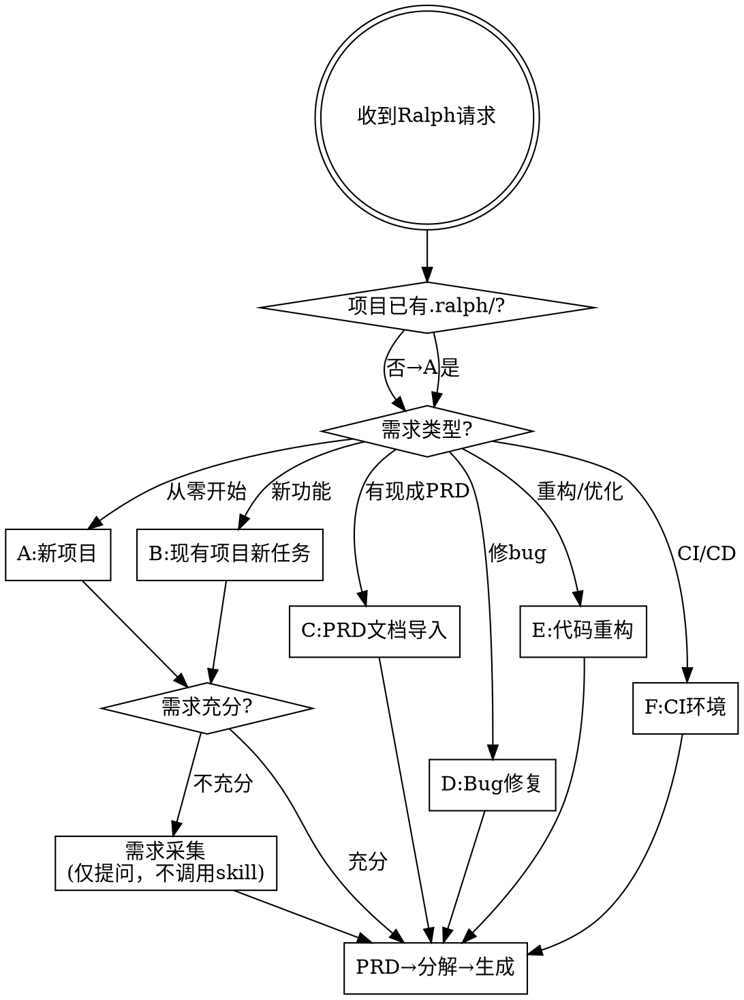

coder-ralph-task---
name: coder-ralph-task
description: Use when setting up Ralph automated development tasks across various scenarios - new project, existing project, PRD import, bug fix, refactoring, or CI setup. Triggers on "Ralph自动化", "设置Ralph任务", "新建Ralph项目", "Ralph修bug", "Ralph重构", "ralph-import", "ralph任务配置".
---

# Coder Ralph Task

为 Ralph 自主开发循环编排任务配置：需求采集 → PRD → 任务分解 → Ralph 文件生成。

<HARD-GATE>
本 skill 只做需求采集和 Ralph 文件配置。禁止在流程中调用任何实现类 skill（writing-plans、execute-plan、brainstorming 等）。需求采集完成后直接进入 PRD 生成，不写计划、不执行代码。
</HARD-GATE>

核心优化：**已完成任务归档，不占用循环上下文**。

## 场景路由



## 上下文优化：已完成任务归档

**核心原则：Ralph 每轮循环读取 PROMPT.md + fix_plan.md，已完成任务会持续占用 token，降低循环效率。**

### 归档策略

| 触发条件 | 操作 |
|---------|------|
| 场景 B/E 更新 fix_plan.md 时 | 已完成的 Completed 任务移入 `.ralph/archive/completed-TIMESTAMP.md` |
| 场景 C 导入新 PRD 时 | 旧任务归档，fix_plan.md 仅保留新任务 |
| 场景 D Bug 修复完成后 | 修复任务归档，恢复之前的 fix_plan.md |
| 归档文件超过 5 个时 | 合并为 `.ralph/archive/history.md`，删除旧归档 |

### 文件内容精简规则

| 文件 | 精简策略 |
|------|---------|
| `PROMPT.md` | 仅保留当前活跃任务的需求描述 + 项目约束 + RALPH_STATUS 格式。已有的架构/设计细节压缩为 1-2 句概要 |
| `fix_plan.md` | 仅保留未完成任务（High/Medium/Low）。Completed 区域用一行摘要点数替代：`## Completed: 15 tasks archived → .ralph/archive/` |
| `AGENT.md` | 仅保留当前任务需要的构建/测试命令，移除无关命令 |

### 归档文件格式

```markdown
# Completed Tasks Archive — YYYY-MM-DD HH:MM

## Summary
- Total completed: N
- Time range: first commit → last commit
- Key outputs: [1-2 sentence summary]

## Details
- [x] 任务1简述
- [x] 任务2简述
...
```

## 需求采集（内置流程）

**禁止调用 brainstorming / writing-plans / execute-plan 等 skill。** 这些 skill 会自动进入写计划或执行代码环节，超出本 skill 范围。

本 skill 的需求采集是纯信息收集：只提问、只记录，不做设计决策，不写代码。

### 采集流程

1. **探索项目上下文** — 读文件、看结构、了解技术栈（只读不改）
2. **逐个提问** — 每次只问一个问题，用 AskUserQuestion 工具
3. **记录需求** — 用户回答后整理，不进入实现
4. **确认充分性** — 所有关键问题回答完毕后，向用户展示需求摘要
5. **进入 PRD 生成** — 需求采集到此结束，不触发任何计划/执行 skill

### 必须覆盖的提问维度

| 维度 | 必问问题 |
|------|---------|
| 业务目标 | 要解决什么问题？核心价值是什么？ |
| 范围边界 | 包含什么？明确不包含什么？ |
| 技术约束 | 语言/框架/已有依赖/部署环境？ |
| 验收标准 | 怎样算完成？可观察的测试/行为？ |
| 风险与依赖 | 有无外部依赖？可能的阻塞点？ |

### 场景专属补充提问

| 场景 | 额外必问 |
|------|---------|
| D: Bug修复 | 复现步骤？错误日志？期望行为？ |
| E: 重构 | 哪些 API/接口不可变？当前痛点？ |
| F: CI | 运行环境？超时限制？通知渠道？ |

### 判断需求是否充分

| 信号 | 充分 | 不充分 |
|------|------|--------|
| 业务目标 | 一句话说清 | 需要长段解释或有歧义 |
| 验收标准 | 有可观察指标 | "做好就行" / "看情况" |
| 技术约束 | 明确栈和限制 | "用什么都可以" / 未确认 |

**有疑问 → 继续提问。宁多问不少问。**

### Rationalization 反制

| 借口 | 事实 |
|------|------|
| "需求很清楚，直接生成 PRD" | 跳过采集 = 遗漏隐含约束 = 后期返工 |
| "调用 brainstorming 更专业" | brainstorming 会自动写计划+执行，超出范围 |
| "需求太简单不需要提问" | 简单项目的问题更隐蔽，5 分钟提问省 5 小时返工 |

## 公共流程

所有场景在需求明确后，统一走此流程：

### 1. PRD 生成

**REQUIRED SUB-SKILL:** 使用 `prd-creator`。

1. 读取 prd-creator 的 PRD.md / JSON.md 子文件
2. 结构化提问收集需求 → 生成 PRD.md 到 `.agent/prd/`
3. 生成 SUMMARY.md 到 `.agent/prd/`
4. 用户审批后 → 生成 tasks.json 到 `.agent/`

任务粒度：≤10 分钟/条，含可验证 pass 条件，初始 `"passes": false`，首条为 `TASK-1` 前置验证。

简单场景（D/E）可生成精简 PRD：仅含问题描述、复现步骤、验收标准。

### 2. 任务分解与编排

**REQUIRED SUB-SKILL:** `ralphinho-rfc-pipeline` 评估复杂度 + `ralph-plan` 构建命令。

| 层级 | 特征 | 策略 |
|------|------|------|
| Tier 1 | 单文件编辑、确定性测试 | 单个 ralph 命令 |
| Tier 2 | 多文件变更、中等集成风险 | 按子系统拆多个 ralph 命令 |
| Tier 3 | DB/认证/性能/安全变更 | 独立命令 + 严格质量门禁 |

构建 DAG 依赖图，每个工作单元生成 ralph 命令：

```xml
<background>[项目背景、核心目标]</background>
<setup>[环境准备、探索代码、激活技能]</setup>
<tasks>[编号任务列表，每条可验证]</tasks>
<testing>[构建/测试/验证命令]</testing>
Output <promise>COMPLETE</promise> when all tasks are done.
```

### 3. Ralph 文件生成

**REQUIRED SUB-SKILL:** 参考 `ralph-loop` 配置指引。

| 文件 | 内容 |
|------|------|
| `.ralph/PROMPT.md` | 活跃任务需求 + 项目约束 + RALPH_STATUS 格式要求 + **即时任务标记规则** |
| `.ralph/fix_plan.md` | 仅未完成任务（按优先级），Completed 归档 |
| `.ralph/AGENT.md` | 构建/测试/质量命令，Git 工作流 |
| `.ralphrc` | 项目配置（类型、权限、熔断器参数） |

### 4. CLAUDE.md 合规预检

**必须动态读取最新的 CLAUDE.md 文件，不得硬编码规则列表。**

1. 读取用户级 CLAUDE.md：`~/.claude/CLAUDE.md` 及其 `@import` 引用的子文件
2. 读取项目级 CLAUDE.md：`<项目根>/.claude/CLAUDE.md` 及其 `@import` 引用的子文件
3. 从读取内容中提取所有规则和要求
4. 逐条对照已生成的 Ralph 文件（PROMPT.md / AGENT.md / .ralphrc / fix_plan.md）
5. **发现不合规 → 立即修正后继续，不得延后**

预检是实时拦截，确保生成过程即合规。完整验证报告在步骤 5.3 输出。

### 5. 输出

任务设计完成后，必须输出以下三部分内容：

#### 5.1 文件改动清单

逐文件列出所有生成/修改的内容，格式：

```markdown
## 📁 文件改动清单

### .ralph/PROMPT.md（新建）
- 项目背景与核心目标：...
- 活跃任务需求描述：...
- 项目约束：...
- RALPH_STATUS 格式要求：...

### .ralph/fix_plan.md（新建）
- 未完成任务列表（按优先级 High/Medium/Low）
- 每条任务含可验证 pass 条件

### .ralph/AGENT.md（新建）
- 构建命令：...
- 测试命令：...
- 质量门禁：...
- Git 工作流规范

### .ralphrc（新建/更新）
- PROJECT_TYPE：...
- ALLOWED_TOOLS：...
- 熔断器参数：...
```

#### 5.2 设计决策说明

对每个关键设计选择，说明"做了什么"和"为什么"：

```markdown
## 🎯 设计决策说明

| 决策项 | 选择 | 原因 |
|--------|------|------|
| 任务拆分粒度 | ≤10分钟/条 | Ralph 单轮上下文有限，细粒度任务降低失败率 |
| Tier 层级 | Tier 2 | 涉及多文件变更，需按子系统拆分独立命令 |
| --no-continue 标志 | 启用 | 新任务应创建新会话，避免旧上下文污染 |
| 归档策略 | 逐次归档 | 已完成任务占用 token，归档提升循环效率 |
| 熔断阈值 CB_NO_PROGRESS=3 | 3次 | 该场景探索空间有限，3次无进展应触发熔断 |
```

#### 5.3 CLAUDE.md 合规验证

**必须动态读取最新的 CLAUDE.md 文件，根据实际内容生成合规报告。**

1. 读取用户级 CLAUDE.md：`~/.claude/CLAUDE.md` 及 `@import` 子文件
2. 读取项目级 CLAUDE.md：`<项目根>/.claude/CLAUDE.md` 及 `@import` 子文件
3. 从实际内容中提取所有规则，逐条检查 Ralph 文件是否合规
4. 输出格式：

```markdown
## ✅ CLAUDE.md 合规验证

### 用户级规则（~/.claude/CLAUDE.md）
[从实际读取内容中提取的每条规则，逐条标注 ✅/❌ + 说明]

### 项目级规则（<项目根>/.claude/CLAUDE.md）
[从实际读取内容中提取的每条规则，逐条标注 ✅/❌ + 说明]

### 不合规项修复建议
> 如有 ❌ 项，列出具体修复操作
```

**不得使用预设规则列表，必须从文件中动态提取。CLAUDE.md 可能随时变化。**

#### 5.4 启动信息

```
🚀 ralph 启动命令：ralph --monitor --notify [参数]
📊 监控命令：...
⏪ 回滚命令：...
```

## 场景 A：新项目初始化

**识别**：目录为空或仅有基础框架，无 `.ralph/`。

1. **需求采集** — 逐项确认业务目标、技术约束、成功标准（仅提问，不调用 skill）
2. 运行 `ralph-setup <name>` 或 `ralph-enable` 创建项目结构
3. 走公共流程 1-5
4. `.ralphrc` 初始配置：

```bash
PROJECT_NAME="<项目名>"
PROJECT_TYPE="<typescript|python|rust|go|generic>"
MAX_CALLS_PER_HOUR=100
CLAUDE_TIMEOUT_MINUTES=15
ALLOWED_TOOLS="Write,Read,Edit,Bash(git add *),Bash(git commit *),Bash(git status *),Bash(git diff *),Bash(git log *)"
SESSION_CONTINUITY=true
CB_NO_PROGRESS_THRESHOLD=3
CB_SAME_ERROR_THRESHOLD=5
CB_COOLDOWN_MINUTES=30
```

## 场景 B：现有项目新任务

**识别**：已有 `.ralph/`，需添加新功能。

1. **评估现有状态** — 读取当前 PROMPT.md / fix_plan.md / AGENT.md / .ralphrc
2. **归档已完成任务** — 清空 fix_plan.md 的 Completed 区域到 `.ralph/archive/`
3. **精简 PROMPT.md** — 旧需求压缩为架构概要（1-2 句），保留项目约束
4. **需求采集**（按需） — 简单任务跳过，模糊需求走内置采集流程（仅提问）
5. 走公共流程 1-5
6. 更新文件：
   - PROMPT.md 追加新需求，标注 `[ACTIVE TASK]`
   - fix_plan.md 仅包含新任务
   - AGENT.md 补充新构建/测试命令（如有）
7. 启动命令：`ralph --monitor --notify --no-continue`

## 场景 C：PRD 文档导入

**识别**：用户有现成 PRD / 需求文档 / 产品规格，想直接导入。

1. **检查文档格式** — 支持 Markdown、文本、JSON、Word、PDF
2. **归档旧任务** — 将现有 fix_plan.md 已完成任务归档
3. 运行 `ralph-import <文档路径>` 自动解析生成 PROMPT.md / fix_plan.md / specs/
4. **审查生成结果** — 确认任务拆分粒度、优先级是否合理
5. 如需调整，手动修正 fix_plan.md 后确认
6. 补充 AGENT.md 和 .ralphrc（如不完整）
7. 启动命令：`ralph --monitor --notify`

## 场景 D：Bug 修复

**识别**：需用 Ralph 自动循环修复已知 Bug。

1. **Bug 信息收集** — 错误现象、复现步骤、期望行为
2. 生成精简 PRD：
   - 问题描述 + 复现步骤 + 期望行为 + 验收标准
   - 不需要完整产品 PRD
3. 任务分解重点：
   - TASK-1: 复现 Bug 并确认
   - TASK-2: 定位根因
   - TASK-3: 实现修复
   - TASK-4: 回归测试
4. PROMPT.md 特殊配置：
   - 明确标注 "此任务为 Bug 修复，优先稳定性，不做无关重构"
   - 包含错误日志 / stack trace 关键信息
5. 启动命令：`ralph --monitor --notify --no-continue --calls 30`

## 场景 E：代码重构 / 优化

**识别**：代码结构优化、性能提升、技术债清理。

1. **明确重构范围** — 目标模块/文件、重构目标、约束（不改外部行为）
2. 生成精简 PRD：当前状态 → 目标状态 + 不变约束
3. 任务分解（按 ralphinho-rfc-pipeline Tier 分层）：
   - 每个独立模块/文件为一个工作单元
   - 每个单元必须包含：实现 → 测试通过 → 行为不退化验证
4. PROMPT.md 特殊配置：
   - "此任务为重构，行为不可变。每个子任务完成后必须跑完整测试套件"
   - 列出不可修改的公共 API / 接口
5. 归档已完成任务（E 场景典型：渐进式重构，每次只处理一部分）
6. 启动命令：`ralph --monitor --notify --backup --no-continue`

## 场景 F：CI 环境配置

**识别**：在 CI/CD 流水线中集成 Ralph，非交互式。

1. 运行 `ralph-enable-ci`：
   ```bash
   ralph-enable-ci --project-name <名> \
     --project-type <类型> \
     --prompt-file <需求文件> \
     --json
   ```
2. 配置 CI 参数：
   - `--timeout 30`：单次执行超时
   - `--calls 20`：限制 API 调用次数
3. 解析退出码：

| 退出码 | 含义 | CI 处理 |
|--------|------|---------|
| 0 | 成功 | 通过 |
| 1 | 通用错误 | 失败 |
| 2 | 已启用 | 用 --force 覆盖 |
| 3 | 参数无效 | 检查配置 |
| 4 | 文件未找到 | 检查路径 |
| 5 | 依赖缺失 | 安装依赖 |

4. CI 脚本示例：
   ```bash
   ralph-enable-ci --project-name $CI_PROJECT_NAME \
     --project-type generic --prompt-file ./specs.md --quiet
   ralph --timeout 30 --calls 20 --output-format json
   ```

## 知识搜索规则

**所有联网搜索必须使用 `web-access` skill。**

禁止：WebSearch、WebFetch、curl 直接抓取。

## Red Flags

- 未判断场景就生成文件 → 必须先路由场景
- 需求模糊但跳过采集 → 有疑问就走内置采集流程（仅提问）
- PRD 未经用户审批 → 必须获得批准
- fix_plan.md 任务粒度 > 10 分钟 → 必须拆分
- PROMPT.md 缺少 RALPH_STATUS 格式 → 必须补充
- Completed 任务留在 fix_plan.md 占上下文 → 必须归档
- 场景 B/C/D/E 未使用 --no-continue → 新任务应创建新会话
- AGENT.md 含自动 git commit → 必须删除
- 含 Co-Authored-By → 必须删除
- 使用 WebSearch/WebFetch → 必须用 web-access
- 输出缺少改动内容 → 必须逐文件列出完整内容
- 输出缺少设计原因 → 每个关键决策必须说明理由
- 输出缺少 CLAUDE.md 合规验证 → 必须逐项检查并输出报告
