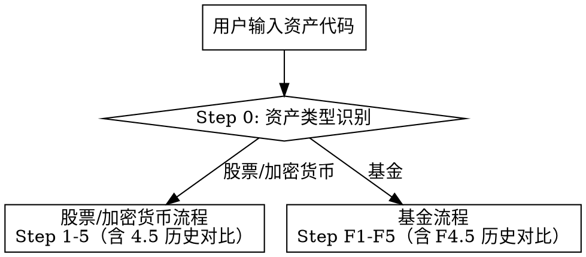

# Coder Stock Analyze

股票/基金/加密货币深度分析全流程编排。资产识别 → 数据采集 → 引擎计算 → Obsidian 报告输出，一站式完成。

## 依赖 Skill

- **stock-analysis**：分析引擎（Python 计算层，仅股票/加密货币使用）
- **web-access**：数据采集（CDP 浏览器）
- **documentation-writer**：文档撰写（结构化内容组织与表达）
- **obsidian-markdown**：Obsidian 格式规范（输出时将报告转为 Obsidian 兼容格式）

## 配置管理

报告输出路径通过配置文件管理。

配置文件路径: `{skillDir}/config.json`

```json
{
  "doc_root": "/Users/horizon/Documents/notes/4.AIOutput/4.1-InvestReport"
}
```

**配置读取逻辑：**
1. 配置不存在或字段缺失 → 用 `AskUserQuestion` 要求用户输入，保存后继续
2. 配置存在且完整 → 直接使用，不再询问
3. 用户要求修改路径 → 更新配置文件

**目录分层结构（`doc_root` 为根目录）：**

```
{doc_root}/                    ← 根目录
├── 投资报告索引.md             ← 索引文件（始终在根目录）
└── Reports/                   ← 报告输出子目录（所有调查报告存放于此）
    ├── 002772_2026-07-09.md
    └── ...
```

- **报告输出目录** = `{doc_root}/Reports`：Step 5 / Step F5 输出的报告文件存放于此
- **历史报告检索目录** = `{doc_root}/Reports`：Step 4.5 / Step F4.5 从此目录检索同标的历史报告
- **索引文件** = `{doc_root}/投资报告索引.md`：始终位于根目录，汇总 `Reports/` 下全部报告

`doc_root` 路径不变（仍是根目录），报告与索引通过 `Reports/` 子目录分层组织。子目录不存在时自动创建。

## 工作流



**流程要点：** 两条流程均在「撰写报告」与「输出报告」之间插入历史报告对比步骤（Step 4.5 / F4.5），从 `doc_root` 检索同标的历史报告，对比关键指标与结论变化，结果作为报告独立章节。

**同行竞争分析（仅股票流程）：** 股票流程在 Step 2 采集阶段确定行业第一龙头（东方财富排名表取候选 + Google 搜索核实，双因子锁定不猜测），Step 4 撰写「九、同行竞争分析」章节（估值/盈利/主营技术/股价表现四维对比），原九~十三章编号后移一位（持仓建议变十…结论变十四）。**加密货币走股票流程但不含本章**（无行业龙头概念），编号不后移，仍用原九~十三章。

---

## 浏览器资源使用契约（采集前必读）

> 本契约约束所有使用 web-access 操作浏览器的步骤（Step 0 确认、Step 2 股票采集、Step F1-F3 基金采集）。
> **违反任一条款 = 直接制造 Chrome 内存泄漏**：tab 只开不关会在浏览器进程内累积，单次股票/基金分析动辄 10+ 页面，无上限并行会让 tab 数失控、Chrome 卡死甚至崩溃。
> 这是硬性资源契约，不是"建议"——任何采集执行方案都必须先通过本契约的检查。

### 三条铁律

| 条款 | 规则 | 为什么 |
|------|------|--------|
| **① Tab 上限** | 同时驻留的本任务 CDP tab **≤ 5 个** | 东方财富等站点密集 tab 易触发反爬风控；超 5 个 tab 显著推高 Chrome 内存占用 |
| **② 即采即关** | 每个 tab 提取完所需数据并校验通过后，**立即 `/close`**，再开下一个 | tab 在采集期间全程驻留 = 泄漏源；"等子 Agent 全部做完再关"会让 tab 在并发窗口内堆积 |
| **③ 并发上限** | 同时在途的 CDP 请求（`/new` `/eval` `/navigate` 等 curl 调用）**全局 ≤ 3 个** | 无上限并发会瞬间打满 Proxy、密集触发反爬、拖慢每个请求的响应 |
| **③ 的全局性** | 这 3 个是**全局总额**，不是"每个子 Agent 各 3 个"——2 个子 Agent 各 2 个在途 = 4，已超限 | "配额越分越多"是常见误算：子 Agent 数变多，每个的并发配额要相应变小，总和恒 ≤ 3 |

### 正确用法（照此执行）

**单 Agent 串行采集（默认）：** 一次只开 ≤ 5 个 tab，每个 tab「开 → 提取 → 校验 → 立刻关」流水作业，任意时刻同时打开的 tab 不超过 5。页面多时分批，前一批关完再开下一批。**主 Agent 自己直接采集（如 Step 0 资产确认、或简单单页核对）走这条**——只开 1 个 tab，取完即关，不涉及并发与配额分配。

**子 Agent 并行采集（仅当确实分治时）：** 总并发 tab 数仍受 5 个上限约束——这是**全局上限**，不是"每个子 Agent 各 5 个"。例如 2 个子 Agent 并行，每个最多同时开 2-3 个 tab；3 个子 Agent 并行，每个最多 1-2 个 tab。主 Agent 在派发子 Agent 时必须在 prompt 中写明该子 Agent 的 tab 配额，并要求子 Agent 内部即采即关。

**并发请求控制：** CDP 的 curl 调用（`/new` `/eval` `/navigate` `/click` `/scroll` `/screenshot` 等）不得同时发起超过 3 个。需要批量提取多个页面时，分批串行或至多 3 路并行；同一 tab 内的多次 `/eval` 也应串行，不要无等待地连续打出。

**关闭责任：** 谁开的 tab 谁关。子 Agent 必须在返回前 `/close` 自己创建的所有 tab——包括采集中途因反爬/异常放弃的 tab；**异常退出也不能留 tab**。主 Agent 在所有子 Agent 返回后，用 `curl -s http://localhost:3456/targets` 检查并补关任何残留的本任务 tab（按 URL 匹配识别，绝不关闭用户原有 tab）。

### 规划自检（采集开始前必做）

制定采集方案时，先回答这三个问题并通过自检，再动手：

1. **本次采集最多会同时打开几个 tab？** 数字必须 ≤ 5。若页面数 > 5，说明要分批——写出分批顺序，每批 ≤ 5 且前一批关闭后才开下一批。
2. **每个 tab 什么时候关？** 必须是"该 tab 数据提取校验完成后立即关"，不能是"子 Agent 全做完后统一关"或"Step 结束后统一关"。
3. **同时在途的 CDP 请求最多几个？** 数字必须 ≤ 3。写出并发安排（串行 / 2 路 / 3 路）。

三个答案写不出具体数字或超限，说明方案不合格——重新分批，不要带着漏洞开采集。

### 红旗（看到立刻停，重新分批）

- 规划出"6 个 tab 同时打开""每个子 Agent 各开 3-4 个 tab 并行"——超上限，重排
- 把并发上限算成"每个子 Agent 各 ≤ 3"导致总在途 4+——3 是全局总额，子 Agent 越多每个配额越小
- 出现"等所有页面采完再一起关 tab"——泄漏模式，改成即采即关
- 同一时刻打出 4+ 个 `/new` 或 `/eval`——并发失控，降为 ≤ 3
- 子 Agent prompt 里没写 tab 配额和即采即关要求——补上再派发
- "这次页面不多，多开几个无所谓"——上限是硬性的，与页面多少无关

---

## Step 0: 资产类型识别

收到资产代码后，先判断类型再分流。

### 代码规则识别

| 代码模式 | 类型 | 示例 |
|----------|------|------|
| `6xxxxx.SS` / `0xxxxx.SZ` / `3xxxxx.SZ` | A股 | 600519.SS, 000895.SZ |
| `159xxx` | 场内ETF | 159915 |
| `5xxxxx` | 场内ETF（沪市） | 510300 |
| `000xxx` / `001xxx` / `002xxx`（无.SZ后缀） | 场外基金 | 000001, 001549 |
| `519xxx` / `007xxx` / `006xxx` | 场外基金 | 519772 |
| `XXXX-USD` | 加密货币 | BTC-USD |
| 纯字母（1-5位） | 美股 | AAPL, MSFT |
| `11xxxx` / `12xxxx` / `50xxxx` | 可转债 | 113050 |

### 确认方法

代码规则仅为初判，**必须通过东方财富确认**（此为浏览器操作，受「浏览器资源使用契约」约束——确认页就 1 个 tab，开 → 取标题 → 立即关）：

- 股票/ETF：访问 `https://quote.eastmoney.com/{代码}.html`，检查页面标题
- 场外基金：访问 `https://fundf10.eastmoney.com/jbgk_{代码}.html`，检查页面标题
- 确认后向用户汇报识别结果

### 分流

| 类型 | 流程 |
|------|------|
| A股 / 美股 / 加密货币 | → 股票流程（Step 1-5） |
| 场内ETF / 场外基金 | → 基金流程（Step F1-F5） |
| 可转债 | → 告知用户暂不支持，建议转为分析对应正股 |

---

## 股票/加密货币流程（Step 1-5）

### Step 1: 生成数据模板

```bash
uv run {stock-analysis-dir}/scripts/analyze_stock.py --data-template TICKER
```

A股代码格式：`000895.SZ`（深市）、`600519.SS`（沪市）

### Step 2: 采集数据

**必须加载 web-access skill 并遵循指引。** 按以下优先级采集：

| 数据 | 推荐来源 | 说明 |
|------|---------|------|
| 实时报价/市值 | 东方财富 quote 页 | A股首选 |
| 估值指标（PE/PB/ROE） | 新浪财经 / 东方财富 | 统计页 |
| 财报历史 | 东方财富 F10 分析页 | 4+季度 |
| K线历史（1年） | 东方财富行情 / 新浪财经 | 252交易日 |
| 分析师评级 | 东方财富研报 / 搜索引擎 | 目标价 |
| 突发新闻 | 搜索引擎 | 近期利好利空 |
| 解禁信息 | data.eastmoney.com/dxf/q/{CODE}.html | 限售股解禁 |
| 行业排名表 | 东方财富 quote 页 innerText | 同行市值/PE/PB/ROE 排名，供 8.2 行业排名与「九、同行竞争分析」确定候选龙头用 |

**并行采集策略：** 将独立采集任务分配给子 Agent 并行执行（如 K线数据 + 新闻 + 解禁信息），主 Agent 负责汇总。子 Agent prompt 中写 `必须加载 web-access skill 并遵循指引`，并注明 `搜索引擎优先级：Google → 必应(https://cn.bing.com/)`。

**⚠️ 并行必须服从「浏览器资源使用契约」：** 所有子 Agent 的 tab 数加总 ≤ 5（全局上限，不是每个子 Agent 各 5），每个子 Agent 的 tab 配额由主 Agent 在 prompt 中写明（如 2 个子 Agent 并行则各 ≤ 2-3 个 tab）。每个子 Agent 必须**即采即关**——tab 提取校验完立即 `/close`，不得等子 Agent 全部做完再统一关。同时在途的 CDP 请求 ≤ 3。若页面总量大，宁可串行分批，也不要突破 tab 上限。

**A股特殊注意事项：**
- 东方财富 F10 财务分析页可能加载错误股票数据，采集后必须核对公司名称
- K线成交量单位通常为「手」（1手=100股），需在 JSON 中转换为股数
- A股无做空/期权数据，sentiment 相关字段设 null
- 市场环境指标（VIX 等）对 A股参考性有限，可用 A股指数替代

**资料留存：** 采集过程中必须同步记录每条数据的来源信息（URL、页面标题、关键内容摘要），格式见附录「资料留存格式」。子 Agent 也须在返回结果时附带资料来源列表。

**同行竞争数据采集（仅 A股 / 美股，加密货币跳过）：**

> 本子步骤为「九、同行竞争分析」章节提供数据，确定行业第一龙头并与标的四维对比。**所有资料必须基于采集与搜索，不得猜测。** 加密货币（`asset_type == "crypto"`）无行业龙头概念，跳过本子步骤，报告亦不含该章节、后续章节编号不后移。

**龙头确定逻辑（双因子锁定，三阶段）：**

```
阶段 A — 从行业排名表取候选龙头（0 新 tab，复用标的行情页已采数据）
  解析标的行情页 innerText 的「行业排名表」→ 按总市值降序取第 1 名为候选龙头
  （记录候选代码/名称/市值/PE/PB/ROE，已在排名表中无需额外采集）
  同步取第 2、3 名作备选
  ※ 美股若东方财富无行业排名表，跳过本阶段，直接进入阶段 B 用 Google 搜 "{行业} 龙头股" 取候选

阶段 B — Google 搜索核实龙头地位（1 tab，即采即关，通过 web-access CDP）
  通过 web-access skill 的 CDP 浏览器访问 Google（不使用内置 WebSearch/WebFetch）：
    开 1 tab 访问 https://www.google.com/search?q={行业名称}+龙头股
    （Google 无效则降级必应 https://cn.bing.com/search?q=...）
  提取搜索结果摘要，核实标准（满足任一即通过）：
    - ≥2 条独立来源称候选为行业龙头/头部企业
    - 候选出现在行业研报/财经媒体的龙头/标杆名单中
  通过 → 定为对比龙头，进入阶段 C
  不通过 → 取备选第 2 名重复阶段 B；最多尝试前 3 名
  前 3 名均不通过 → 取第 1 名，报告中标注"市值第一但龙头地位未获独立来源确认"
  tab 即采即关（核实完立即 /close，不等阶段 C）

阶段 C — 采集龙头股对比数据（2 tab，串行即采即关）
  Tab 1（龙头行情页 + 业绩财报，1 tab 内串行）：
    - 访问 quote.eastmoney.com/sh{龙头代码}.html，取 innerText：当前价/市值/PE(动)/PB
    - 同 tab 内 JS fetch 业绩报表 API 取近 8 期：营收/净利/毛利率/ROE/同比
      https://datacenter-web.eastmoney.com/api/data/v1/get
        ?reportName=RPT_LICO_FN_CPD&columns=ALL
        &filter=(SECURITY_CODE="{龙头代码}")
        &pageNumber=1&pageSize=8&sortColumns=REPORTDATE&sortTypes=-1
      （需带 Referer: https://data.eastmoney.com/ 头）
    - 校验完成 → 立即 /close
  Tab 2（龙头主营产品与技术路线，1 tab）：
    - 取龙头行情页核心题材区；信息不全时 Google 搜 "{龙头名称} 主营产品 技术路线"
    - 提取主营产品/技术路线/客户结构 → 立即 /close
  龙头近 1 年涨跌幅：用 push2his K线 API（secid=1.{龙头代码}, lmt=260, beg/end 间隔 1 年）
    取首尾收盘价计算涨跌幅（行情页 innerText 无明确近 1 年涨跌幅字段，K线最可靠）
    可在 Tab 1 同 tab 内 fetch，或单独算
```

**浏览器资源规划自检：**
- 最多同时 tab：1（阶段 B、C 串行，前一个关才开下一个）
- 关闭时机：每 tab 提取校验完立即 `/close`
- CDP 并发：≤2（同 tab 内 `/eval` 与 `fetch` 串行）
- 与 Step 2 主采集并行：本子步骤依赖标的行情页行业排名表，须等标的行情页采完后启动；建议作为独立子 Agent（tab 配额 2）与 K线/新闻/解禁子 Agent（tab 配额 2）并行，加总 ≤4

**龙头对比数据采集清单：**

| 数据维度 | 具体指标 | 数据源 |
|----------|----------|--------|
| 估值指标 | 总市值、PE(动)、PB | 行业排名表（已有）+ 龙头行情页 innerText |
| 盈利能力 | 营收、净利润、毛利率、ROE（近 8 期） | datacenter 业绩报表 API（RPT_LICO_FN_CPD） |
| 主营产品 | 核心产品/业务构成 | 龙头行情页核心题材区 + Google 核实 |
| 技术路线 | 技术方向/竞争优势 | 阶段 B Google 搜索结果摘要 |
| 股价表现 | 近 1 年涨跌幅 | push2his K线 API（secid=1.{龙头代码}）算首尾收盘价 |

**龙头数据存放：** 将龙头对比数据存入 `/tmp/TICKER_data.json` 的 `_peer_comparison` 字段（含龙头代码/名称/各维度数据/核实依据），供 Step 4 撰写「九、同行竞争分析」用。资料留存 category 记为 `同行竞争数据`。

**数据保存：** 将所有采集数据合并到模板 JSON，保存至 `/tmp/TICKER_data.json`

### Step 3: 运行分析引擎

```bash
uv run {stock-analysis-dir}/scripts/analyze_stock.py TICKER --data /tmp/TICKER_data.json --output json
```

引擎输出 JSON 包含各维度评分和综合建议，作为报告撰写的数据基础。

### Step 4: 撰写 Obsidian 报告

**两阶段流程：先撰写内容，再转为 Obsidian 格式。**

**阶段一：撰写报告内容** — 加载 `documentation-writer` skill，按以下章节模板组织内容：
- 基于 Step 2 采集数据和 Step 3 引擎结果，综合分析撰写
- 表格数据必须有来源说明
- 利好利空需区分优先级，重大事件给详细时间线
- 合理价位需用多种估值方法交叉验证
- 结论需给出乐观/中性/悲观三种情景
- **加密货币（`asset_type == "crypto"`）跳过「九、同行竞争分析」章节**，章节编号不后移，直接按原九~十三章顺序撰写（持仓建议为九、参考资料为十…结论为十三）；A 股 / 美股则正常撰写本章并采用九~十四的新编号

**阶段二：转为 Obsidian 格式** — 加载 `obsidian-markdown` skill，将阶段一内容转为 Obsidian 兼容格式：
- 添加 frontmatter（title、date、tags、aliases）
- 使用 Obsidian 特有语法：`[[wikilinks]]`、callout（`> [!warning]`）、内部链接
- 确保表格、列表等 Markdown 元素符合 Obsidian 渲染规范

报告章节模板：

```markdown
---
title: {公司简称}({TICKER})深度分析报告
date: {YYYY-MM-DD}
tags: [投资分析, {行业}, {TICKER}]
aliases: [{公司简称}分析]
---

> [!warning] ⚠️ 免责声明
> 本报告仅供参考，不构成投资建议

## 一、公司概况

## 二、核心估值指标
### 2.1 价格与市值
### 2.2 估值水平
### 2.3 盈利能力
### 2.4 财务健康
### 2.5 分红回报

## 三、技术面分析
### 3.1 动量指标
### 3.2 K线形态解读
### 3.3 板块对比

## 四、分析师评级

## 五、财报表现

## 六、近期利好与利空
### 🔴 利空因素
### 🟢 利好因素
### 🟡 中性因素

## 七、解禁信息（专项分析）

## 八、综合评分
### 8.1 引擎与人工综合评分
（基于 Step 3 分析引擎八维度评分 + 人工修正，给出综合评级与置信度）

### 8.2 行业排名
（基于 Step 2 采集的东方财富行情页行业对比数据，列出标的在所属行业中的各项排名。需包含：行业名称、行业样本数、标的在各维度的排名位次，以及"高/较高/中/低"四分位属性。示例格式如下）

| 排名维度 | 标的数值 | 行业平均 | 行业排名 | 四分位属性 |
|----------|----------|----------|----------|------------|
| 总市值 | {值} | {均值} | {n/N} | {较高/高/中/低} |
| 净资产 | {值} | {均值} | {n/N} | {...} |
| 净利润 | {值} | {均值} | {n/N} | {...} |
| 市盈率(动) | {值} | {均值} | {n/N} | {...} |
| 市净率 | {值} | {均值} | {n/N} | {...} |
| 毛利率 | {值} | {均值} | {n/N} | {...} |
| 净利率 | {值} | {均值} | {n/N} | {...} |
| ROE | {值} | {均值} | {n/N} | {...} |

> [!note] 行业排名解读
> 用 2-3 句话总结标的的行业地位：哪些维度领先（如盈利能力跻身前列）、哪些维度落后（如市值规模偏小），结合估值排名与盈利排名的剪刀差给出定性判断。数据来源须标注采集日期。
>
> （本节为标的在全行业的横向位次描述；与行业第一龙头的点对点深度对比见「九、同行竞争分析」）

## 九、同行竞争分析

> [!info] 本章对比标的与所属行业第一龙头的关键指标，数据均来源于公开搜索与数据采集，采集日期 {YYYY-MM-DD}。
> ※ 加密货币（`asset_type == "crypto"`）无行业龙头概念，不含本章，后续章节编号不后移。

### 9.1 龙头股确定

**行业名称：** {行业名称}（行业样本数 {N} 只）

| 步骤 | 操作 | 结果 |
|------|------|------|
| 1. 行业排名表取候选 | 东方财富行情页行业排名表按总市值排序取第 1 名 | 候选龙头：{名称}（{代码}），总市值 {X} 亿 |
| 2. 搜索引擎核实 | 通过 web-access CDP 访问 Google 搜 "{行业} 龙头股"，核查独立来源 | {通过/未通过}：{核实依据，如"3 篇研报/财经媒体报道称其为行业龙头"} |
| 3. 最终确定 | — | 对比龙头：**{龙头名称}（{龙头代码}）** |

> [!note] 龙头选择说明
> {核实通过：说明市值与行业共识双维度居首。取第 2 名：说明第 1 名市值虽大但龙头地位未获确认。取第 1 名但标注未确认：说明市值第一但缺独立来源佐证，结论需谨慎。}

### 9.2 多维对比表

| 对比维度 | {标的简称}（{标的代码}） | {龙头简称}（{龙头代码}） | 对比解读 |
|----------|------------------------|------------------------|----------|
| 总市值 | {值} 亿 | {值} 亿 | {约为龙头的 X%} |
| 市盈率(动) | {值} | {值} | {估值高低判断} |
| 市净率 | {值} | {值} | {估值高低判断} |
| 营业收入(最新期) | {值} 亿 | {值} 亿 | {营收规模比} |
| 净利润(最新期) | {值} 亿 | {值} 亿 | {盈利规模比} |
| 毛利率 | {值}% | {值}% | {毛利率差值与原因} |
| ROE | {值}% | {值}% | {回报率对比} |
| 营收同比 | {值}% | {值}% | {成长性对比} |
| 净利同比 | {值}% | {值}% | {成长性对比} |

> [!note] 估值与盈利对比解读
> 2-3 句话总结：标的估值比龙头便宜/贵、盈利能力（毛利率/ROE）是否接近或落后、成长性是否优于龙头。给出"估值盈利性价比"定性判断。

### 9.3 主营产品与技术路线对比

| 对比项 | {标的简称} | {龙头简称} |
|--------|-----------|-----------|
| 核心产品/业务 | {主营产品描述} | {主营产品描述} |
| 技术路线/工艺 | {技术方向} | {技术方向} |
| 客户结构 | {主要客户} | {主要客户} |
| 竞争优势 | {标的差异化优势} | {龙头核心壁垒} |

> [!note] 产品与技术解读
> 对比产品定位（同质化/差异化）、技术路线（跟随/并行/领先）、目标市场（重叠/互补），判断标的是龙头的直接竞争者、补充者还是追赶者。

### 9.4 股价表现对比

| 对比项 | {标的简称} | {龙头简称} |
|--------|-----------|-----------|
| 当前价 | {值} | {值} |
| 近 1 年涨跌幅 | {值}% | {值}% |
| 近 6 月涨跌幅 | {值}% | {值}% |
| 近 1 月涨跌幅 | {值}% | {值}% |

> [!note] 股价表现解读
> 对比同期涨跌幅差异。标的涨幅显著超龙头 → 可能估值透支或事件驱动；显著落后 → 反映市场对其竞争力的定价。结合 9.2/9.3 基本面差异解释股价分化。

### 9.5 竞争地位结论

> [!summary] 竞争地位综合判断
> {标的简称}与行业龙头 {龙头简称} 相比：
> - **规模地位：** {领先/接近/落后/显著落后}——{一句话}
> - **盈利能力：** {优于/相当/弱于}龙头——{一句话}
> - **估值水平：** {更低/相当/更高}——{一句话}
> - **成长性：** {更快/相当/更慢}——{一句话}
> - **竞争角色：** {行业龙头 / 直接竞争者 / 差异化追赶者 / 细分领域领先者}
>
> **综合判断：** {1-2 句话给出竞争地位定性及相对龙头的投资价值判断}

## 十、持仓建议与合理价位
### 10.1 投资建议
### 10.2 合理价位评估
### 10.3 关键价位一览

## 十一、参考资料

> [!info] 以下为分析过程中采集的原始资料来源，按数据类别分组列出

### 11.1 实时报价与估值指标
| 来源 | URL | 关键内容 |
|------|-----|---------|
| {来源名称} | {URL} | {摘要} |

### 11.2 财报与财务指标
| 来源 | URL | 关键内容 |
|------|-----|---------|
| {来源名称} | {URL} | {摘要} |

### 11.3 K线与行情数据
| 来源 | URL | 关键内容 |
|------|-----|---------|
| {来源名称} | {URL} | {摘要} |

### 11.4 分析师评级与研报
| 来源 | URL | 关键内容 |
|------|-----|---------|
| {来源名称} | {URL} | {摘要} |

### 11.5 新闻与资讯
| 来源 | URL | 关键内容 |
|------|-----|---------|
| {来源名称} | {URL} | {摘要} |

### 11.6 同行竞争数据
| 来源 | URL | 关键内容 |
|------|-----|---------|
| {来源名称} | {URL} | {摘要} |

### 11.7 其他
| 来源 | URL | 关键内容 |
|------|-----|---------|
| {来源名称} | {URL} | {摘要} |

## 十二、风险提示

## 十三、历史报告对比

## 十四、结论
```

### Step 4.5: 历史报告对比

> 本步骤在 Step 4 撰写报告内容、Step 5 输出报告之间执行。**目的**：同一标的多次分析时，对比关键指标与结论的变化，呈现趋势演进，避免每次报告都是"孤立快照"。

**检索逻辑：**
1. 报告检索目录 = `{doc_root}/Reports`（读取 `config.json` 的 `doc_root` 后拼 `Reports` 子目录）
2. 按代码前缀匹配历史报告：在 `Reports/` 下查找文件名以 `{代码}_` 开头的 `.md` 文件（如 `002772_2026-07-09.md`、`002772_*.md`）
   - 命名变体兼容：部分历史报告含公司简称（如 `000895_双汇发展_分析报告_20260617.md`）、对比报告（如 `601818vs601166_...`），凡文件名以本次代码开头或包含 `_{代码}_`/`_{代码}vs` 均纳入候选
   - **排除本次正在生成的报告**（避免自对比）
3. 按日期降序排序，取最近 **1-3 份**作为对比基准（年代久远的仅作背景参考）
4. 无历史报告 → 跳过本步骤，报告中「历史报告对比」章节标注"首次分析，无历史记录"

**对比内容（从历史报告 frontmatter 与正文中提取）：**

| 对比维度 | 说明 |
|----------|------|
| 采集日期 | 历次报告的 `date` / `data_date` |
| 股价 | 历次分析时的最新价、距 52 周高低点位置 |
| 估值 | PE（动/TTM/静态）、PB |
| 盈利 | 最近一期营收/净利及同比、毛利率、净利率、ROE |
| 综合建议 | 引擎评级 + 人工修正结论 |
| 合理价位 | 历次给出的合理价位区间 |
| 关键结论 | 一句话总结历次判断 |

**对比呈现方式：**
- 以**表格**横向对比历次报告的关键指标（最新列置左，历史列置右，按日期倒序）
- 用文字说明**指标变化方向与原因**：哪些改善、哪些恶化、哪些维持
- 重点标注**与本期的差异**：本期相对上一期的变化（如估值从低估变为合理、评级从买入转为持有、合理价位上修/下修）
- 如历史结论与后续走势背离，客观复盘（不事后诸葛亮，基于当时数据评判）

**章节定位：** 对比结果写入报告「十三、历史报告对比」章节（位于风险提示之后、结论之前）。该章节为独立章节，便于快速纵览标的分析的历史脉络。

### Step 5: 输出报告

1. 报告输出目录 = `{doc_root}/Reports`（读取 `config.json` 的 `doc_root` 后拼 `Reports` 子目录）
2. 确认 `Reports` 子目录存在，不存在则创建
3. 文件命名格式：**`{代码}_{YYYY-MM-DD}.md`**
   - A股：`000895_2026-06-17.md`
   - 美股：`AAPL_2026-06-17.md`
   - 加密货币：`BTC-USD_2026-06-17.md`
4. 向用户确认文件路径
5. 使用 Obsidian vault write 工具保存报告至 `{doc_root}/Reports/`（如可用），否则直接写文件
6. **更新投资报告索引**：按「投资报告索引维护规范」章节更新 `{doc_root}/投资报告索引.md`（新增本次报告条目、刷新总数与时间范围、更新 frontmatter 的 `updated` 字段）
7. 任务清理：用 `curl -s http://localhost:3456/targets` 检查并补关任何残留的本任务 CDP tab（按 URL 匹配识别，绝不关闭用户原有 tab）。正常情况下采集阶段已即采即关，此步仅作兜底。

---

## 基金流程（Step F1-F5）

基金分析的核心差异：**关注组合管理能力而非单一公司经营**，重点分析持仓结构而非财务报表。

### Step F1: 采集基金概况

**必须加载 web-access skill 并遵循指引。** 基金采集页面多（F1-F3 合计可达 13 页），**必须服从「浏览器资源使用契约」**：同时驻留 tab ≤ 5，即采即关，CDP 请求并发 ≤ 3。13 页须分批（每批 ≤ 5，前一批关闭后再开下一批）或分配给子 Agent 并行（各子 Agent tab 配额加总 ≤ 5）。

从东方财富基金 F10 页面采集，URL模板：`https://fundf10.eastmoney.com/{页面代码}_{基金代码}.html`

| 数据 | 页面代码 | 必采字段 |
|------|---------|---------|
| 基本概况 | jbgk | 基金全称、类型、成立日期、规模、基金经理、费率、业绩基准、跟踪标的 |
| 阶段涨幅 | jdzf | 各区间涨幅、同类排名、四分位排名 |
| 历史净值 | jjjz | 近期净值走势数据（用于技术分析） |
| 分红送配 | fhsp | 累计分红次数和金额 |

**场内ETF额外采集：**

| 数据 | 来源 | 说明 |
|------|------|------|
| 实时行情 | quote.eastmoney.com | 场内价格、涨跌幅、成交额 |
| 折溢价率 | quote页面或计算 | 场内价格 vs 单位净值 |

### Step F2: 采集持仓信息

**基金分析的核心步骤——持仓决定了基金的风险收益特征。**

| 数据 | 页面代码 | 采集内容 |
|------|---------|---------|
| 股票持仓 | ccmx | 前十大重仓股：代码、名称、占净值比、持仓市值、持股数 |
| 债券持仓 | ccmx1 | 前五大债券：代码、名称、占净值比、持仓市值 |
| 行业配置 | hytz | 各行业占净值比、市值、行业市盈率 |
| 资产配置 | zcpz | 股票/债券/现金占净比、净资产规模 |
| 持仓变动 | ccbd | 近期重大调仓 |
| 持有人结构 | cyrjg | 机构/个人/内部持有占比 |

**持仓分析要点：**
1. **持仓集中度**：前十大重仓股占净值比之和，>50% 为高集中度（风险集中但弹性大），<30% 为分散（稳健但弹性小）
2. **持仓风格**：从重仓股判断是大盘/中盘/小盘、价值/成长/均衡风格
3. **行业偏离**：对比业绩基准的行业分布，偏移>5% 的行业需重点关注
4. **换手率**：对比相邻季度持仓变化，高换手 = 交易频繁（可能有择时倾向）
5. **持仓估值**：重仓股的 PE/PB 中位数，反映基金经理估值偏好

### Step F3: 采集基金经理与评级

| 数据 | 页面代码 | 采集内容 |
|------|---------|---------|
| 基金经理 | jjjl | 任职期限、管理规模、过往业绩 |
| 基金评级 | jjpj | 招商/济安金信/上海证券等评级 |
| 规模变动 | gmbd | 规模趋势（持续缩水需警惕） |

**基金经理评估要点：**
- 任职 < 1年：历史数据参考性低
- 任职 > 3年：可评估完整牛熊周期表现
- 共管基金：多人共管时关注核心经理

**资料留存：** 采集过程中必须同步记录每条数据的来源信息（URL、页面标题、关键内容摘要），格式见附录「资料留存格式」。子 Agent 也须在返回结果时附带资料来源列表。

### Step F4: 撰写基金 Obsidian 报告

**两阶段流程：先撰写内容，再转为 Obsidian 格式。**

**阶段一：撰写报告内容** — 加载 `documentation-writer` skill，按以下章节模板组织内容：
- 持仓分析是核心，需占报告 40% 以上篇幅
- 每只重仓股需标注所属行业和近期涨跌
- 行业配置需与业绩基准对比，突出偏离
- ETF 必须分析折溢价率和跟踪误差
- 场外基金必须分析主动管理能力（超额收益）
- 投资建议需区分定投和一次性投资场景

**阶段二：转为 Obsidian 格式** — 加载 `obsidian-markdown` skill，将阶段一内容转为 Obsidian 兼容格式：
- 添加 frontmatter（title、date、tags、aliases）
- 使用 Obsidian 特有语法：`[[wikilinks]]`、callout（`> [!warning]`）、内部链接
- 确保表格、列表等 Markdown 元素符合 Obsidian 渲染规范

报告章节模板：

```markdown
---
title: {基金简称}({代码})深度分析报告
date: {YYYY-MM-DD}
tags: [投资分析, 基金, {基金类型}, {代码}]
aliases: [{基金简称}分析]
---

> [!warning] ⚠️ 免责声明
> 本报告仅供参考，不构成投资建议

## 一、基金概况
### 1.1 基本信息
### 1.2 费率结构
### 1.3 基金经理

## 二、业绩表现
### 2.1 阶段涨幅与同类排名
### 2.2 历史净值走势
### 2.3 与基准对比

## 三、持仓分析（核心章节）
### 3.1 资产配置
### 3.2 股票持仓明细
### 3.3 持仓集中度与风格判断
### 3.4 行业配置
### 3.5 债券持仓
### 3.6 持仓变动趋势

## 四、持有人结构

## 五、规模变动

## 六、场内交易分析（仅ETF）
### 6.1 折溢价率
### 6.2 流动性（日均成交额）
### 6.3 跟踪误差

## 七、风险提示

## 八、历史报告对比

## 九、参考资料

> [!info] 以下为分析过程中采集的原始资料来源，按数据类别分组列出

### 9.1 基金概况与净值数据
| 来源 | URL | 关键内容 |
|------|-----|---------|
| {来源名称} | {URL} | {摘要} |

### 9.2 持仓与行业配置
| 来源 | URL | 关键内容 |
|------|-----|---------|
| {来源名称} | {URL} | {摘要} |

### 9.3 基金经理与评级
| 来源 | URL | 关键内容 |
|------|-----|---------|
| {来源名称} | {URL} | {摘要} |

### 9.4 新闻与资讯
| 来源 | URL | 关键内容 |
|------|-----|---------|
| {来源名称} | {URL} | {摘要} |

### 9.5 其他
| 来源 | URL | 关键内容 |
|------|-----|---------|
| {来源名称} | {URL} | {摘要} |

## 十、投资建议
### 10.1 适合场景
### 10.2 不适合场景
### 10.3 定投/一次性投资建议
```

### Step F4.5: 历史报告对比

> 本步骤在 Step F4 撰写报告内容、Step F5 输出报告之间执行。**目的**：同一基金多次分析时，对比关键指标与结论的变化，呈现趋势演进。检索逻辑同股票流程 Step 4.5。

**检索逻辑：** 报告检索目录 = `{doc_root}/Reports`，在 `Reports/` 下按基金代码前缀匹配 `{基金代码}_*.md`（排除本次报告），取最近 1-3 份，无历史则标注"首次分析"。

**基金对比维度（与股票不同，聚焦组合管理）：**

| 对比维度 | 说明 |
|----------|------|
| 采集日期 | 历次报告日期 |
| 单位净值/场内价 | 历次分析时价格、折溢价率（ETF） |
| 阶段涨幅 | 近 1 月/3 月/1 年回报变化 |
| 规模 | 历次净资产规模、规模变动趋势 |
| 持仓 | 前十大重仓股变化、持仓集中度变化、行业配置漂移 |
| 基金经理 | 是否变更、任职期限变化 |
| 评级 | 历次机构评级变化 |
| 综合建议 | 历次投资建议 |

**章节定位：** 对比结果写入报告「八、历史报告对比」章节（位于风险提示之后、参考资料之前）。

### Step F5: 输出报告

1. 报告输出目录 = `{doc_root}/Reports`（读取 `config.json` 的 `doc_root` 后拼 `Reports` 子目录）
2. 确认 `Reports` 子目录存在，不存在则创建
3. 文件命名格式：**`{基金代码}_{YYYY-MM-DD}.md`**
   - 场内ETF：`159915_2026-06-17.md`
   - 场外基金：`000001_2026-06-17.md`
4. 向用户确认文件路径
5. 使用 Obsidian vault write 工具保存报告至 `{doc_root}/Reports/`（如可用），否则直接写文件
6. **更新投资报告索引**：按「投资报告索引维护规范」章节更新 `{doc_root}/投资报告索引.md`（新增本次报告条目、刷新总数与时间范围、更新 frontmatter 的 `updated` 字段）
7. 任务清理：用 `curl -s http://localhost:3456/targets` 检查并补关任何残留的本任务 CDP tab（按 URL 匹配识别，绝不关闭用户原有 tab）。正常情况下采集阶段已即采即关，此步仅作兜底。

---

## 东方财富基金页面URL速查

| 页面 | URL |
|------|-----|
| 基金概况 | `https://fundf10.eastmoney.com/jbgk_{CODE}.html` |
| 基金经理 | `https://fundf10.eastmoney.com/jjjl_{CODE}.html` |
| 基金评级 | `https://fundf10.eastmoney.com/jjpj_{CODE}.html` |
| 历史净值 | `https://fundf10.eastmoney.com/jjjz_{CODE}.html` |
| 分红送配 | `https://fundf10.eastmoney.com/fhsp_{CODE}.html` |
| 阶段涨幅 | `https://fundf10.eastmoney.com/jdzf_{CODE}.html` |
| 股票持仓 | `https://fundf10.eastmoney.com/ccmx_{CODE}.html` |
| 债券持仓 | `https://fundf10.eastmoney.com/ccmx1_{CODE}.html` |
| 行业配置 | `https://fundf10.eastmoney.com/hytz_{CODE}.html` |
| 资产配置 | `https://fundf10.eastmoney.com/zcpz_{CODE}.html` |
| 持仓变动 | `https://fundf10.eastmoney.com/ccbd_{CODE}.html` |
| 持有人结构 | `https://fundf10.eastmoney.com/cyrjg_{CODE}.html` |
| 规模变动 | `https://fundf10.eastmoney.com/gmbd_{CODE}.html` |
| 费率 | `https://fundf10.eastmoney.com/jjfl_{CODE}.html` |

---

## 投资报告索引维护规范

> 本规范定义 `{doc_root}/投资报告索引.md` 的结构与更新逻辑，供 Step 5 / Step F5 在输出报告后执行。索引是全部投资报告的统一入口，每生成新报告必须同步更新，保持索引与目录文件一致。
>
> **分层关系**：索引文件位于 `{doc_root}/投资报告索引.md`（根目录），报告文件位于 `{doc_root}/Reports/`（子目录）。索引汇总 `Reports/` 下全部报告，wikilink 用纯文件名（不带 `Reports/` 前缀），Obsidian 自动解析到子目录文件。

### 索引文件结构

```markdown
---
title: 投资报告索引
type: index
status: active
created: {首次创建日期}
updated: {本次更新日期}
tags:
  - 投资分析
  - 索引
  - InvestReport
---

# 投资报告索引

> [!summary] 概览
> 本索引汇总 `4.AIOutput/4.1-InvestReport/Reports` 目录下全部投资分析报告，共 **{N} 篇**。
> - 覆盖时间：{最早日期} ~ {最晚日期}
> - 类型：个股深度分析、ETF/基金分析、主题投资、对比分析、市场异动分析
> - 表格按日期倒序排列（最新在前），同一日期按代码升序。

## 报告总览

| 代码 | 报告标题 | 日期 | 文档链接 |
| :--- | :--- | :--- | :--- |
| {代码} | {报告标题} | {YYYY-MM-DD} | [[{文件名}\|📄查看]] |

## 说明

- **代码列**：标的证券代码；对比类报告列出双方代码；主题/市场类报告无单一标的，记为「—」。
- **文档链接列**：点击 `📄查看` 可直接打开对应报告原文（基于文件名唯一的 wikilink）。
- 本索引为自动汇总，如新增报告需同步更新此表格。
```

### 更新逻辑（每次输出报告后执行）

1. **读取索引**：`{doc_root}/投资报告索引.md`（位于根目录）。文件不存在 → 按上述结构新建（`created` 与 `updated` 均填本次日期），同时确保 `{doc_root}/Reports/` 子目录存在。报告文件存放于 `Reports/` 子目录，索引汇总该子目录下全部 `.md` 报告。
2. **新增条目**：在「报告总览」表格中插入本次报告行，**插入位置 = 按日期倒序**（本次日期最新则置顶；与已有同日期条目按代码升序排列）。
   - **代码列**：股票/加密货币填标的代码；基金填基金代码；对比类报告填"代码A / 代码B"；主题/市场类报告填「—」。
   - **报告标题列**：取报告 frontmatter 的 `title`（若无则取首个 `#` 一级标题）。
   - **日期列**：取报告 frontmatter 的 `date`，格式 `YYYY-MM-DD`。
   - **文档链接列**：`[[{文件名}\|📄查看]]`，文件名含特殊字符（如 `-👀`）时原样保留；wikilink 中 `|` 需转义为 `\|`。
3. **刷新概览**：更新 `[!summary]` callout 中的总篇数（= 表格行数）、覆盖时间范围（最早/最晚日期）。
4. **更新 frontmatter**：`updated` 字段改为本次日期。
5. **去重校验**：若本次代码 + 日期的组合已存在（同一天重复分析同一标的），**更新原行**而非新增行，避免重复条目。
6. 保存写回 `{doc_root}/投资报告索引.md`。

### 同步原则

- 索引仅记录 `{doc_root}/Reports/` 子目录下的报告文件，根目录或其他位置的报告不纳入。
- 索引文件本身 `{doc_root}/投资报告索引.md` 位于根目录，不列入 `Reports/`，也不计入报告总览表格（它是索引，不是报告）。
- 报告文件被删除/重命名时，索引相应行应同步移除/更新（本 skill 输出流程不涉及删除，但人工维护时需注意）。
- wikilink 始终用纯文件名（不带 `Reports/` 路径前缀），Obsidian 依文件名唯一性自动解析到子目录；若 `Reports/` 内出现同名文件需重命名以保证唯一。

---

## 执行规范

- 每个 Step 完成后向用户汇报进度
- 采集数据时遇到来源不可用，切换备选来源，不卡在单一来源
- 引擎输出与人工判断冲突时，在报告中标注差异并给出综合判断
- 报告中所有数据必须标明采集日期（市场数据有时效性）
- **搜索引擎优先级**：Google → 必应(https://cn.bing.com/)。需使用搜索引擎时（新闻、研报、信息核实等），按此顺序逐级尝试，首选 Google，无有效结果再切换必应

---

## 附录：资料留存格式

采集数据时，每条记录须包含以下字段：

```json
{
  "source_name": "东方财富-个股行情",
  "url": "https://quote.eastmoney.com/601166.html",
  "page_title": "兴业银行(601166)股票行情_东方财富网",
  "key_content": "当前价18.88，总市值3928亿，PE 4.89，PB 0.51",
  "category": "实时报价与估值指标"
}
```

**字段说明：**

| 字段 | 必填 | 说明 |
|------|------|------|
| `source_name` | 是 | 来源名称，格式：`平台-页面类型`（如 `东方财富-个股行情`、`新浪财经-财务指标`、`Google搜索-新闻`） |
| `url` | 是 | 数据来源的完整URL |
| `page_title` | 否 | 页面标题，有助于后续核实 |
| `key_content` | 是 | 从该来源获取的关键数据摘要 |
| `category` | 是 | 数据分类，对应报告「参考资料」章节的子分类（股票：实时报价与估值指标/财报与财务指标/K线与行情数据/分析师评级与研报/新闻与资讯/同行竞争数据/其他；基金：基金概况与净值数据/持仓与行业配置/基金经理与评级/新闻与资讯/其他） |

**留存时机：** 每完成一条数据的采集，立即记录，不要等采集结束后补录（避免遗漏）。

**子 Agent 传递：** 子 Agent 在返回结果时，须同时返回 `references` 数组，包含上述格式的所有资料记录。主 Agent 汇总后写入报告「参考资料」章节。
