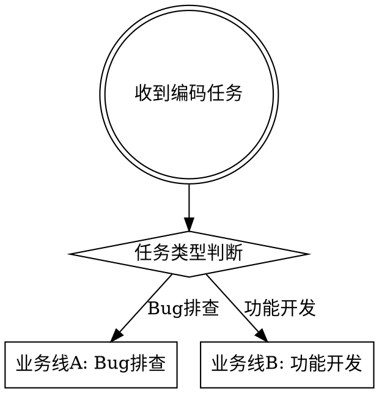
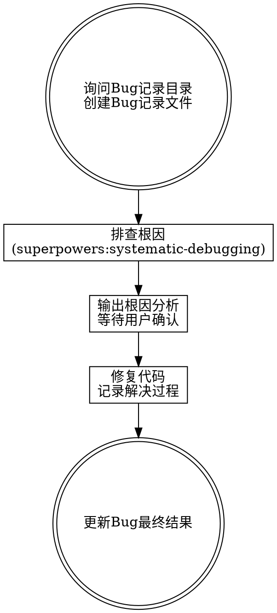
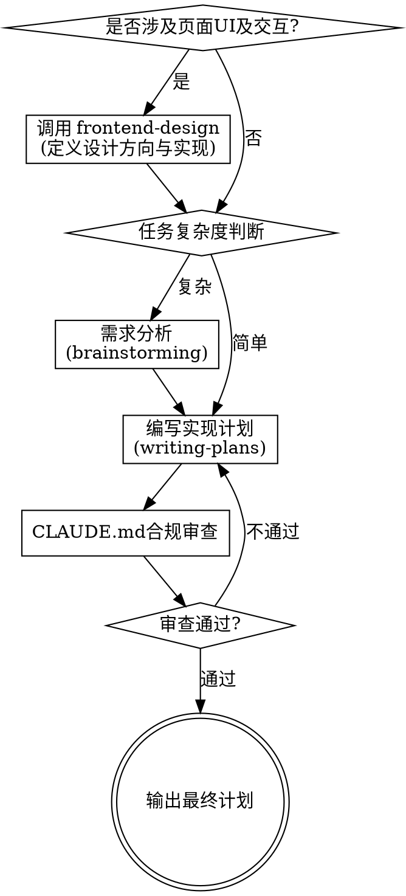

# Coder Task

编码任务路由器：判断任务类型 → 走对应业务线。Bug 排查走业务线 A，功能开发走业务线 B。**功能开发中，凡涉及页面 UI 及交互的，必须自动调用 `frontend-design` skill。**

## 主路由



### 分类信号

| 信号 | Bug 排查 | 功能开发 |
|------|---------|---------|
| 典型关键词 | 修复、bug、排查、报错、异常、crash、不生效、错误、失败、fix、debug | 开发、实现、新增、添加、接口、功能、模块、feat、create、add |
| 任务性质 | 已有代码出了问题 | 需要编写新代码 |
| 用户意图 | "出了问题，帮我看看" | "帮我做个新功能" |

### 判断规则

1. **明确关键词匹配** → 直接分类
2. **混合信号**（如"修复接口并增加新字段"）→ 拆分为两个子任务，分别走对应业务线
3. **无法判断** → 向用户确认，不要猜测

---

## 业务线 A: Bug 排查



### A-1: 询问记录目录

判定为 Bug 后，**第一步**询问用户：

> Bug 记录文件保存到哪个目录？（默认：项目根目录下 `docs/bugs/`）

- 用户指定目录 → 使用用户指定路径
- 用户未指定 → 使用默认 `docs/bugs/`
- 目录不存在 → 自动创建

### A-2: 创建 Bug 记录文件

文件名格式：`YYYY-MM-DD_bug-简短描述.md`（Asia/Shanghai 时区）

模板：

```markdown
# Bug: [简短描述]

## Bug 描述

[用户反馈的问题现象，包含错误信息、复现步骤等]

## Bug 原因

[排查后填入：根因分析结果]

## Bug 解决思路

[排查后填入：建议的修复方案]

## Bug 解决过程

### 第 1 轮

- **用户反馈**: [用户描述的问题/需求]
- **解决方案**: [采取的解决措施]

### 第 2 轮

- **用户反馈**: [用户对第 1 轮解决方案的反馈/新问题]
- **解决方案**: [根据反馈调整的解决措施]

（后续轮次按需追加）

## Bug 最终结果

[未解决 / 已解决]

[如已解决，简要说明最终修复方案]
```

### A-3: 记录时机

| 阶段 | 记录内容 |
|------|---------|
| 创建文件时 | 填入 **Bug 描述**（用户原始反馈） |
| 根因分析完成 | 填入 **Bug 原因** 和 **Bug 解决思路** |
| 每轮修复后 | 追加 **解决过程** 第 N 轮：用户反馈 + 解决方案 |
| Bug 关闭时 | 填入 **Bug 最终结果**（已解决/未解决） |

### A-4: 排查确认机制

**铁律：先说原因，不改代码。等用户说"改"再改。**

1. **排查阶段** — 使用 `superpowers:systematic-debugging`（**REQUIRED SUB-SKILL**）定位根因，此阶段只读代码/日志/证据，**禁止修改任何文件**
2. **输出根因** — 向用户报告：根因、位置、原因、建议修复方案
3. **等待确认** — 明确询问："以上分析是否正确？是否按此方案修复？"
4. **用户确认后** — 才修改代码，同时更新 Bug 记录的解决过程

### A-5: 最终结果

Bug 解决或用户主动终止时更新：

- **已解决** — 说明最终修复方案
- **未解决** — 说明当前进展和阻塞原因

---

## 业务线 B: 功能开发



### B-0: 页面 UI / 交互判断（功能开发第一步，先于复杂度判断）

判定为功能开发后，**第一步**先判断需求是否涉及页面 UI 或交互：

| 信号 | 涉及页面 UI / 交互 | 不涉及 |
|------|-------------------|--------|
| 典型关键词 | 页面、界面、UI、布局、样式、组件、卡片、导航栏、表单、按钮、动画、过渡、hover、交互、可视化、图表、大屏、前端展示 | 接口、服务、定时任务、脚本、数据库、迁移、命令行工具、纯后端逻辑 |
| 任务产物 | 用户在浏览器/客户端能看到的视觉元素或能操作的交互行为 | 用户不直接感知的后端代码或数据 |

**判断规则：**

1. **只要产物中包含"用户能看到/能操作的 UI 或交互"即为"涉及"**——即便任务同时含后端逻辑（如带表单校验的提交接口），UI 部分也触发本规则。
2. **涉及 → MUST 调用 `frontend-design` skill**（见 B-2a），无例外。"用户没要求设计感""已有设计稿""我自己会写 CSS"均不构成跳过理由——设计稿已有则用 frontend-design 核校一致性，自己写 CSS 则用 frontend-design 把控视觉质量。
3. **不涉及 → 跳过 frontend-design**，直接进入 B-1 复杂度判断。
4. **无法判断 → 向用户确认产物形态**，不要猜测跳过。

### B-2a: 调用 frontend-design（涉及 UI/交互时强制）

**REQUIRED SUB-SKILL:** 当 B-0 判定为"涉及"时，使用 `frontend-design`，**与 brainstorming/writing-plans 并行衔接**：

- 在需求分析/方案设计阶段：用 `frontend-design` 确立设计方向（美学基调、配色、字体、动效、空间构成），避免通用 AI 模板化视觉
- 在编写实现计划阶段：用 `frontend-design` 指导组件视觉规范、交互细节、动效实现方式，确保产物达到生产级设计质量
- `frontend-design` 的设计输出作为 `brainstorming` 的设计维度输入、`writing-plans` 的实现依据，而非独立环节

### B-1: 复杂度判断

| 信号 | 简单任务 | 复杂任务 |
|------|---------|---------|
| 涉及模块数 | 1-2 个 | 3 个以上 |
| 需求清晰度 | 明确，无需追问 | 模糊，需要讨论确认 |
| 技术方案 | 已有现成模式 | 需要探索和选型 |
| 影响范围 | 单一功能点 | 跨子系统或多角色 |

**有疑问时默认判断为复杂。**

### B-2: 需求分析（复杂任务）

**REQUIRED SUB-SKILL:** 使用 `superpowers:brainstorming`

- 逐个确认：业务目标、技术约束、成功标准
- 提出 2-3 种方案及权衡
- 获得用户对设计的明确批准
- 产出设计文档保存到 `docs/superpowers/specs/`

简单任务跳过此步。

### B-3: 编写实现计划

**REQUIRED SUB-SKILL:** 使用 `superpowers:writing-plans`

- 文件名格式: `YYYY-MM-DD_HH-xx.md`（Asia/Shanghai 时区，xx 为中文计划名称）
- 保存路径: `docs/superpowers/plans/`
- 每个任务包含：文件路径、完整代码、测试命令、预期输出
- 无占位符（TBD/TODO 禁止出现）

### B-4: CLAUDE.md 合规审查

审查顺序：用户级 `~/.claude/CLAUDE.md`（最高优先）→ 项目级 `.claude/CLAUDE.md`

| 检查项 | 审查内容 |
|--------|---------|
| 语言要求 | 沟通/注释是否符合语言要求 |
| Git 规范 | Conventional Commits，无禁止的 Co-Authored-By |
| Git 自动提交 | 无自动 git commit 步骤 |
| 技术栈规范 | 代码风格符合项目技术栈 |
| 项目特定规则 | 遵循项目 CLAUDE.md 特殊要求 |
| 文件命名 | 符合 `YYYY-MM-DD_HH-xx.md` 格式 |

不通过则修正后重新审查。

### B-5: 输出最终计划

审查通过后，向用户确认计划内容，提供执行选项（参考 writing-plans 的 Execution Handoff）。

---

## 依赖检查

触发时**必须**先检查依赖 skill 是否可用：

| 依赖 skill | 用途 | 检查方式 |
|------------|------|---------|
| `superpowers:systematic-debugging` | Bug 排查根因 | `ls ~/.claude/plugins/cache/claude-plugins-official/superpowers/*/skills/systematic-debugging/SKILL.md` |
| `superpowers:brainstorming` | 复杂任务需求分析 | `ls ~/.claude/plugins/cache/claude-plugins-official/superpowers/*/skills/brainstorming/SKILL.md` |
| `superpowers:writing-plans` | 编写实现计划 | `ls ~/.claude/plugins/cache/claude-plugins-official/superpowers/*/skills/writing-plans/SKILL.md` |
| `frontend-design` | 页面 UI / 交互开发的设计与实现 | `ls ~/.claude/skills/frontend-design/SKILL.md` |
| `web-access` | 联网搜索 | `ls ~/.claude/skills/web-access/SKILL.md` |

缺失时向用户报告并给出安装指引，不继续执行。

## 知识搜索规则

**只使用 `web-access` skill 搜索，禁止 WebSearch/WebFetch/curl。**

## Red Flags

- 未检查依赖就执行 → 必须先检查
- 依赖缺失仍继续 → 停下来报告
- 跳过类型判断 → 必须先判断
- Bug 排查直接改代码 → 先输出根因等确认
- Bug 排查阶段修改文件 → 排查阶段只读不改
- Bug 未询问记录目录 → 必须先询问
- Bug 未创建记录文件 → 判定为 bug 后必须创建
- Bug 记录缺少字段 → 必须包含：描述、原因、解决思路、解决过程、最终结果
- 解决过程未按轮次记录 → 每轮追加第 N 轮
- Bug 关闭未更新最终结果 → 必须填写
- 混合任务只走一条线 → 拆分为两条业务线
- 功能开发未先做 B-0 UI/交互判断 → 必须先判断
- 涉及 UI/交互却跳过 frontend-design → MUST 调用，无例外
- 把 frontend-design 当"可选辅助"而非强制 → 涉及即强制，不可跳过
- 以"用户没要求设计感""已有设计稿""自己会写 CSS"为由跳过 frontend-design → 不构成跳过理由
- 纯后端/接口任务误调用 frontend-design → 仅 UI/交互才调用
- 复杂任务跳过 brainstorming → 必须分析
- 计划含 TBD/TODO → 补全或删除
- 未审查 CLAUDE.md → 必须审查
- 计划含自动 git commit → 删除
- 使用 WebSearch/WebFetch → 必须用 web-access
