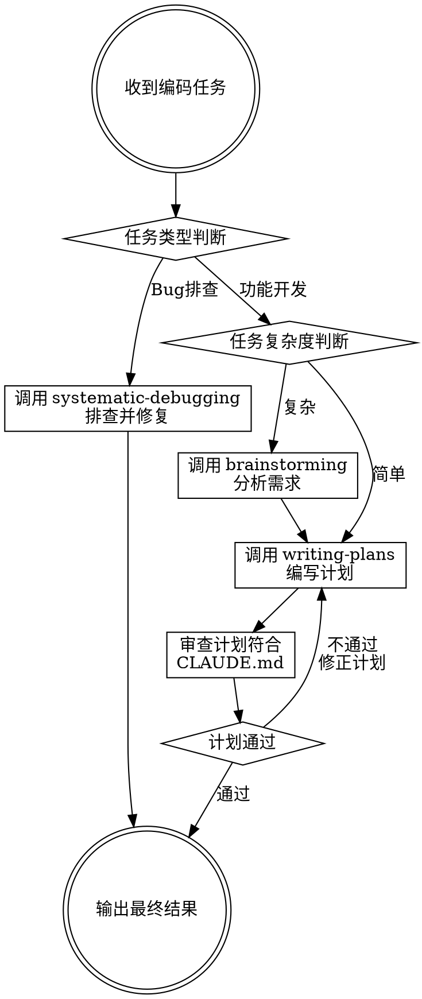

# Coder Task

收到编码任务后，先判断任务类型再走对应流程：bug 排查走 `systematic-debugging`，功能开发走结构化计划流程。确保不同类型任务使用正确的方法论。

## 核心流程



## Step 0: 任务类型判断

收到编码任务后，**首先**判断任务类型，决定走哪条流程。

### 分类信号

| 信号 | Bug 排查 | 功能开发 |
|------|---------|---------|
| 典型关键词 | 修复、bug、排查、报错、异常、crash、不生效、错误、失败、fix、debug、报错信息 | 开发、实现、新增、添加、接口、功能、模块、feat、create、add |
| 任务性质 | 已有代码出了问题，需要定位原因并修复 | 需要编写新代码实现新能力 |
| 用户意图 | "出了问题，帮我看看" | "帮我做个新功能" |

### 判断规则

1. **明确的关键词匹配** → 直接分类
2. **混合信号**（如"修复接口并增加新字段"）→ 拆分为两个子任务：bug 部分走 systematic-debugging，新功能部分走功能开发流程
3. **无法判断** → 向用户确认任务类型，不要猜测

### 路由结果

- **Bug 排查** → 跳转 `systematic-debugging` skill（**REQUIRED SUB-SKILL**），完成排查修复后输出结果
- **功能开发** → 进入 Step 1 继续功能开发流程

## 依赖检查

coder-task 依赖以下 skill，触发时**必须**先检查是否可用：

| 依赖 skill | 来源 | 用途 | 检查方式 |
|------------|------|------|---------|
| `systematic-debugging` | `~/.claude/skills/` 或 superpowers 插件 | Bug 排查流程 | `ls ~/.claude/skills/systematic-debugging/SKILL.md` |
| `web-access` | `~/.claude/skills/` 或 `~/.agents/skills/` | 联网搜索 | `ls ~/.claude/skills/web-access/SKILL.md` |
| `superpowers:brainstorming` | superpowers 插件 | 复杂任务需求分析 | `ls ~/.claude/plugins/cache/claude-plugins-official/superpowers/*/skills/brainstorming/SKILL.md` |
| `superpowers:writing-plans` | superpowers 插件 | 编写实现计划 | `ls ~/.claude/plugins/cache/claude-plugins-official/superpowers/*/skills/writing-plans/SKILL.md` |

### 检查流程

1. 使用 Bash 逐一检查依赖 skill 的 SKILL.md 是否存在
2. **全部可用** → 正常执行对应流程
3. **有缺失** → 向用户报告缺失列表，并给出安装指引

### 安装指引

**缺失 `systematic-debugging` 或 `web-access`**（本地 skill）：
```bash
# 方式一：如果有 claude-extend 仓库，重新运行安装脚本
cd <claude-code-extend 仓库路径> && bash scripts/install.sh

# 方式二：手动创建符号链接
ln -s <skill 源路径> ~/.claude/skills/<skill-name>
```

**缺失 `superpowers:brainstorming` 或 `superpowers:writing-plans`**（插件 skill）：
```
这些 skill 来自 superpowers 插件，需要：
1. 确认已安装 superpowers 插件
2. 运行 /install-superpowers 或在 Claude Code 设置中启用该插件
3. 插件安装后，skill 会自动注册到可用列表
```

### 检查时机

- **每次触发 coder-task 时**执行依赖检查
- 路由到具体流程前确认对应依赖可用（如路由到 bug 排查前确认 systematic-debugging 可用）
- 不要在依赖缺失的情况下继续执行，避免流程中断

## 知识搜索规则

**当任务执行过程中需要搜索相关知识时，只使用 `web-access` skill 进行搜索。**

**禁止的搜索方式：**
- 禁止使用 WebSearch 工具
- 禁止使用 WebFetch 工具
- 禁止使用 curl 直接抓取网页

**唯一允许的方式：** 调用 `web-access` skill，由其根据场景自动选择最优联网工具。

**适用场景：**
- 需要搜索技术方案、最佳实践
- 需要查阅 API 文档、官方文档
- 需要了解库/框架的用法
- 任何需要联网获取信息的场景

**不适用场景：**
- 仅需读取本地项目文件、代码 — 直接用 Read/grep
- 无需联网的纯逻辑推理 — 直接分析

## Step 1: 复杂度判断（功能开发）

收到开发任务后，先判断任务复杂度：

| 信号 | 简单任务 | 复杂任务 |
|------|---------|---------|
| 涉及模块数 | 1-2 个 | 3 个以上 |
| 需求清晰度 | 明确，无需追问 | 模糊，需要讨论确认 |
| 技术方案 | 已有现成模式 | 需要探索和选型 |
| 影响范围 | 单一功能点 | 跨子系统或多角色 |

**有疑问时默认判断为复杂** — 宁可多分析，不可漏分析。

## Step 2: 需求分析（复杂任务）

**REQUIRED SUB-SKILL:** 使用 `superpowers:brainstorming` 分析需求。

- 与用户逐个确认：业务目标、技术约束、成功标准
- 提出 2-3 种方案及权衡
- 获得用户对设计的明确批准
- 产出设计文档保存到 `docs/superpowers/specs/`

简单任务跳过此步，直接进入 Step 3。

## Step 3: 编写实现计划

**REQUIRED SUB-SKILL:** 使用 `superpowers:writing-plans` 编写实现计划。

- 计划文件名格式: `YYYY-MM-DD_HH-xx.md`（HH 为 Asia/Shanghai 时区，xx 为中文计划名称）
- 保存路径: `docs/superpowers/plans/`
- 每个任务包含：文件路径、完整代码、测试命令、预期输出
- 无占位符（TBD/TODO 禁止出现）

## Step 4: CLAUDE.md 合规审查

计划编写完成后，**必须**审查计划是否符合 CLAUDE.md 规范。

### 审查顺序

1. **用户级 CLAUDE.md** — `~/.claude/CLAUDE.md`（优先级最高）
2. **项目级 CLAUDE.md** — 项目根目录下的 `.claude/CLAUDE.md`

### 审查清单

逐项检查计划是否违反 CLAUDE.md 中的规则：

| 检查项 | 审查内容 |
|--------|---------|
| 语言要求 | 计划中的沟通/注释是否符合语言要求（如中文回复） |
| Git 规范 | 提交信息是否遵循 Conventional Commits，是否包含禁止的 Co-Authored-By |
| Git 自动提交 | 计划中是否包含自动 git commit 步骤（应删除） |
| 技术栈规范 | 代码风格是否符合项目技术栈要求（如 Golang 规范） |
| 项目特定规则 | 是否遵循项目 CLAUDE.md 中的特殊要求 |
| 计划文件命名 | 是否符合 `YYYY-MM-DD_HH-xx.md` 格式 |

### 审查结果处理

- **通过**: 进入 Step 5
- **不通过**: 修正计划中违反规则的步骤，重新检查

## Step 5: 输出最终计划

审查通过后，向用户确认最终计划内容，提供执行选项（参考 writing-plans 的 Execution Handoff）。

## Red Flags — 停下检查

- 未检查依赖 skill 是否可用就执行流程 → 必须先检查依赖
- 依赖缺失但仍继续执行 → 停下来报告缺失并引导安装
- 跳过任务类型判断直接写计划 → 必须先判断是 bug 还是功能
- Bug 排查任务走了功能开发流程 → 必须路由到 systematic-debugging
- 功能开发任务走了 systematic-debugging → 确认分类是否正确
- 混合任务只走了一条流程 → 拆分为 bug 修复 + 功能开发两个子任务
- 跳过复杂度判断直接写计划 → 必须先判断
- 复杂任务跳过 brainstorming → 复杂任务必须分析需求
- 计划包含 TBD/TODO → 补全或删除
- 未审查 CLAUDE.md 就输出计划 → 必须审查
- 只读了项目级 CLAUDE.md 忽略用户级 → 用户级优先
- 计划中包含自动 git commit 步骤 → 删除自动提交
- 计划提交信息包含 Co-Authored-By → 删除
- 使用 WebSearch/WebFetch/curl 搜索知识 → 必须使用 web-access skill

## Common Mistakes

| 错误 | 修正 |
|------|------|
| 未检查依赖就执行，到一半发现 skill 不可用 | 每次触发时先检查所有依赖 skill 是否已安装 |
| 依赖缺失时自行跳过或降级处理 | 停下来报告缺失，引导用户安装后再继续 |
| Bug 排查走功能开发流程写实现计划 | Bug 必须路由到 systematic-debugging，先找根因再修复 |
| 功能开发走 systematic-debugging | 功能开发应走 brainstorming → writing-plans 流程 |
| 混合任务只处理一部分 | 拆分为 bug 修复 + 功能开发，分别走对应流程 |
| 无法判断任务类型时猜测 | 向用户确认任务类型 |
| 所有任务都走 brainstorming | 简单任务直接写计划，节约时间 |
| 只判断为简单跳过分析但需求实际模糊 | 有疑问就判断为复杂 |
| 审查 CLAUDE.md 时遗漏用户级文件 | 用户级优先于项目级 |
| 审查不通过但直接输出 | 必须修正后重新审查 |
| 计划中包含 git 自动提交 | CLAUDE.md 禁止自动提交，删除该步骤 |
| 使用 WebSearch/WebFetch 搜索知识 | 必须通过 web-access skill 进行所有联网搜索 |
