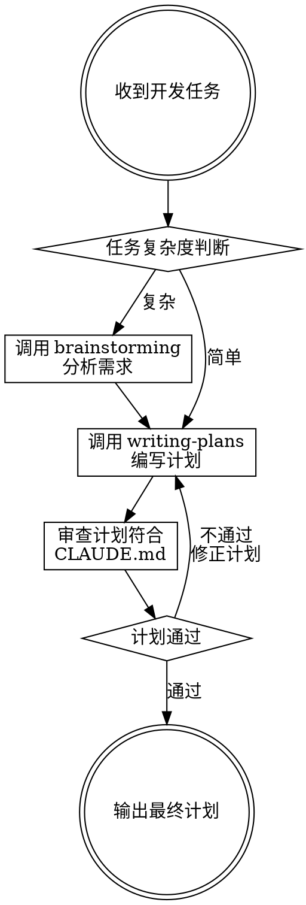

# Coder Task

收到开发任务后，通过结构化流程产出经 CLAUDE.md 审查通过的实现计划，确保计划符合项目规范。

## 核心流程

## Step 1: 复杂度判断

收到开发任务后，先判断任务复杂度：

| 信号 | 简单任务 | 复杂任务 |
|------|---------|---------|
| 涉及模块数 | 1-2 个 | 3 个以上 |
| 需求清晰度 | 明确，无需追问 | 模糊，需要讨论确认 |
| 技术方案 | 已有现成模式 | 需要探索和选型 |
| 影响范围 | 单一功能点 | 跨子系统或多角色 |

**有疑问时默认判断为复杂** — 宁可多分析，不可漏分析。

## Step 2: 需求分析（复杂任务）

**REQUIRED SUB-SKILL:** 使用 `superpowers:brainstorming` 分析需求。

- 与用户逐个确认：业务目标、技术约束、成功标准
- 提出 2-3 种方案及权衡
- 获得用户对设计的明确批准
- 产出设计文档保存到 `docs/superpowers/specs/`

简单任务跳过此步，直接进入 Step 3。

## Step 3: 编写实现计划

**REQUIRED SUB-SKILL:** 使用 `superpowers:writing-plans` 编写实现计划。

- 计划文件名格式: `YYYY-MM-DD_HH-xx.md`（HH 为 Asia/Shanghai 时区，xx 为中文计划名称）
- 保存路径: `docs/superpowers/plans/`
- 每个任务包含：文件路径、完整代码、测试命令、预期输出
- 无占位符（TBD/TODO 禁止出现）

## Step 4: CLAUDE.md 合规审查

计划编写完成后，**必须**审查计划是否符合 CLAUDE.md 规范。

### 审查顺序

1. **用户级 CLAUDE.md** — `~/.claude/CLAUDE.md`（优先级最高）
2. **项目级 CLAUDE.md** — 项目根目录下的 `.claude/CLAUDE.md`

### 审查清单

逐项检查计划是否违反 CLAUDE.md 中的规则：

| 检查项 | 审查内容 |
|--------|---------|
| 语言要求 | 计划中的沟通/注释是否符合语言要求（如中文回复） |
| Git 规范 | 提交信息是否遵循 Conventional Commits，是否包含禁止的 Co-Authored-By |
| Git 自动提交 | 计划中是否包含自动 git commit 步骤（应删除） |
| 技术栈规范 | 代码风格是否符合项目技术栈要求（如 Golang 规范） |
| 项目特定规则 | 是否遵循项目 CLAUDE.md 中的特殊要求 |
| 计划文件命名 | 是否符合 `YYYY-MM-DD_HH-xx.md` 格式 |

### 审查结果处理

- **通过**: 进入 Step 5
- **不通过**: 修正计划中违反规则的步骤，重新检查

## Step 5: 输出最终计划

审查通过后，向用户确认最终计划内容，提供执行选项（参考 writing-plans 的 Execution Handoff）。

## Red Flags — 停下检查

- 跳过复杂度判断直接写计划 → 必须先判断
- 复杂任务跳过 brainstorming → 复杂任务必须分析需求
- 计划包含 TBD/TODO → 补全或删除
- 未审查 CLAUDE.md 就输出计划 → 必须审查
- 只读了项目级 CLAUDE.md 忽略用户级 → 用户级优先
- 计划中包含自动 git commit 步骤 → 删除自动提交
- 计划提交信息包含 Co-Authored-By → 删除

## Common Mistakes

| 错误 | 修正 |
|------|------|
| 所有任务都走 brainstorming | 简单任务直接写计划，节约时间 |
| 只判断为简单跳过分析但需求实际模糊 | 有疑问就判断为复杂 |
| 审查 CLAUDE.md 时遗漏用户级文件 | 用户级优先于项目级 |
| 审查不通过但直接输出 | 必须修正后重新审查 |
| 计划中包含 git 自动提交 | CLAUDE.md 禁止自动提交，删除该步骤 |
